# Naiba Chat 应用说明书（1.6.9 Beta）

> 本说明书面向「第一次打开 Naiba Chat」的小白读者，配图全部来自真实运行界面（1.6.9 Beta · 源码模式 · 截图 2026-09-03）。

---

## 阅读路径

- **只想聊天** → 看第 1～2 章
- **想玩花的** → 重点看第 3 章
- **想查设置** → 直接翻第 5 章
- **出问题** → 第 6 章

---

## 十大亮点（用 30 秒了解 Naiba Chat 能干什么）

1. **一个不够就接一堆模型**：在线 8 种格式（OpenAI 兼容 / Claude / Gemini / Codex / LM Studio / Ollama / llama.cpp / Unsloth）+ 本地模型一键连。
2. **Skill：给 AI 装"行业操作手册"**：写小说、跑 ComfyUI、写视频提示词……用 `/` 一键把领域知识塞进对话。
3. **MCP：给 AI 插外设**：ComfyUI、文件、网页……只要 MCP 服务器在跑，AI 就能直接调用。
4. **ComfyUI 自动流水线**：批改工作流 → 批量提交 → 自动收图 → 缩略图预览 → 一句话复用到下一轮。
5. **RunningHub 云端生成**：没显卡也能出 420+ 类型的图、视频、音频、3D。
6. **并行与分身**：后台 Job + 子 Agent，任务互不阻塞，跑图的时候还能写稿。
7. **手机/局域网远程访问**：同 WiFi 扫码，躺床上也能用家里电脑。
8. **权限三档**：确认 / 自动 / 完全，按场景随时切。
9. **稳如老狗**：断线重连不重放、失败不丢已生成内容、SHA-256 校验更新、可版本回退。
10. **🆕 1.6.9 文件面板**：AI 改过的文件直接在右侧看、可编辑、可存回磁盘，**改了什么一目了然**。

---

# 第 1 章　三分钟跑起来

> **读完这章你能**：自己装好 Naiba Chat、配上一个能跑的模型、发第一句对话。

## 1.1 它到底是什么

Naiba Chat 不是聊天框，是装在你电脑上的 **AI 工作台**——它能跟你对话，更能直接动手：读你的文件、改你的代码、跑你的命令、上网搜资料、出图出视频。**所有数据留在本地**，API Key 不出机器。

## 1.2 下载、解压、双击

1. 去 GitHub Releases 页面下载 `naiba-chat-1.6.9-beta-windows-x64.zip`。
2. **解压到可写目录**（桌面 / D 盘 / 工作盘都行，**不要放 `C:\Program Files`**，需要写权限）。
3. 双击 `naiba-chat.exe`（或源码模式直接 `python server.py`）。
4. 浏览器自动打开 `http://127.0.0.1:8765`，看到主界面就成功了。

## 1.3 第一次打开要做的三件事

> **本机访问免口令**；手机/局域网访问要口令（在「连接状态」页查看）。

1. **填一个模型** → 右上角 ⚙ 设置 → 「API 供应商」→ 添加或选一个现成供应商 → 点「检查」测连通。

   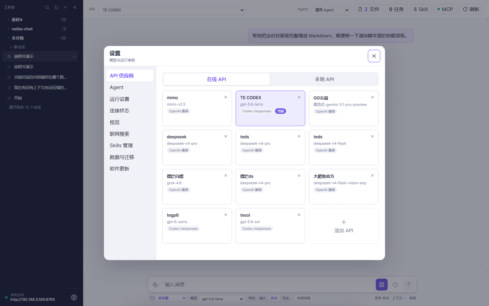

2. **选一个 Agent** → 顶栏「Agent」下拉里选「通用 Agent」/「编程」/「短剧」等。

3. **发第一句话** → 底部输入框打字 → 按 `Enter` 或点 ↑ 发送。

> **没配过模型？** 主界面空态里已经放了 8 个常用指令按钮（点一下就发），新手按顺序点「列出所有可用工具」试试水。

## 1.4 界面 30 秒认识

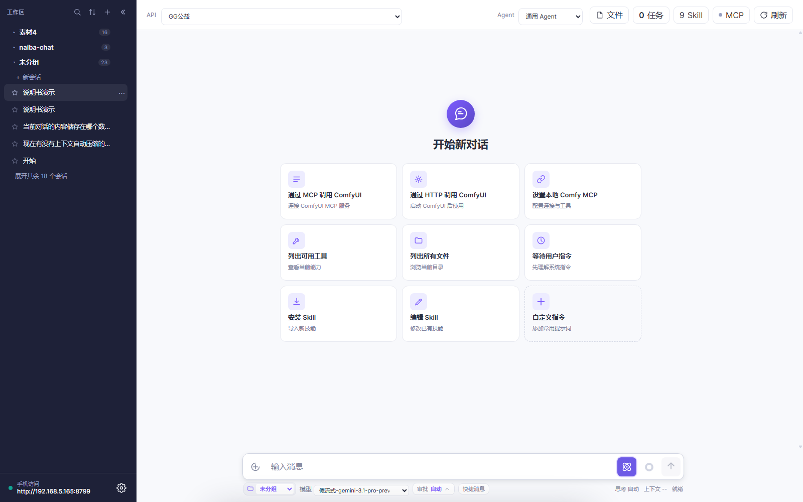

| 区域 | 你能干什么 |
|---|---|
| **顶栏左** | 展开/收起侧栏（新版可折叠） |
| **顶栏中** | 切模型、切 Agent |
| **顶栏右** | 任务 / Skill / MCP / 刷新 4 个按钮 |
| **左侧栏** | 工作区、会话、设置入口、局域网手机访问地址 |
| **中间聊天区** | 对话、思考块、工具块、产物、本轮修改文件、Token 用量 |
| **右侧文件面板** | 1.6.9 新增：AI 改过的文件在这里多标签预览/编辑 |
| **底部输入区** | 附件 / 深度思考 / 上下文用量环 / 发送按钮 |
| **底部状态栏** | 审批档位、轻量选项（工具 / Skill 独立勾选）、就绪状态 |

## 1.5 你必须知道的三个开关

### ① 审批三档

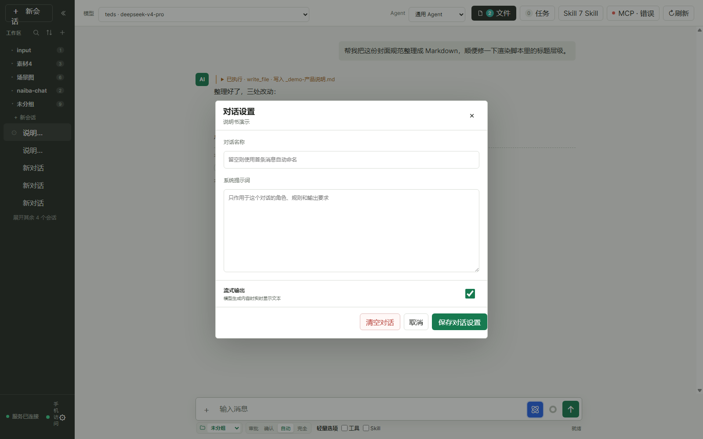

底部「审批」切到哪一档，决定 AI 跑工具要不要你点头：

- **确认**（默认）：每次工具调用都弹「需要确认」卡片 → 你点「允许执行」才跑（**最安全**）。
- **自动**：工作区内的操作不用问；工作区外的写操作才问。
- **完全**：工具无需逐次确认（**最省事，但写错可能毁文件**）。

### ② 轻量选项（1.6.9 重构）

底部「轻量选项」两个独立勾选：

- 勾选 **工具** → 关闭本对话的工具调用
- 勾选 **Skill** → 关闭本对话的 Skill 能力
- **都不勾** → 普通模式（默认）
- 新建会话默认不自动勾（之前的「轻量对话」开关已废除）

适用场景：纯聊天不写代码就勾工具；只想问 Skill 内容但不想让 AI 注入就勾 Skill。

### ③ 深度思考

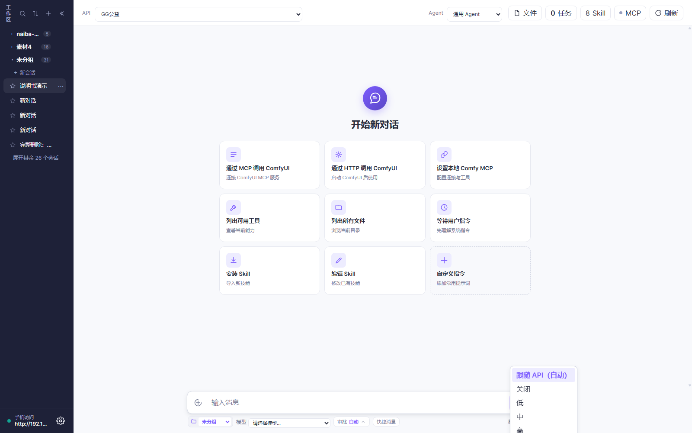

输入区右侧球形按钮，点开有 5 档：

- **跟随 API（自动）**——按模型自身行为
- **关闭**——直接答，不思考
- **低 / 中 / 高**——强制思考强度

模型支持时（DeepSeek-R1、Claude、o1/o3）才有效，否则忽略。

---

# 第 2 章　一次对话能干什么

> **读完这章你能**：让 AI 读你的文件、改你的代码、跑你的命令、出你的图，而且知道每一步在背后发生了什么。

## 2.1 普通问答

直接在输入框打字发就行。AI 拿到的是你**当前会话的完整上下文**（含系统提示词 + 历史消息 + Skill + 工具结果）。

## 2.2 让它读 / 写 / 搜文件

| 你说的话 | AI 用什么 |
|---|---|
| 「读一下 README.md 头三行」 | `read_file` |
| 「把 build_info.json 的 version 改成 1.6.10」 | `read_file` + `edit_file` |
| 「在 docs/ 下搜包含 'TODO' 的 md」 | `search_files` + `grep_files` |
| 「列出工作区所有 png」 | `list_directory` |
| 「在 assets/ 下创建 cover.jpg 占位」 | `write_file` |
| 「把这两个文件合成一个」 | `read_file` + `write_file` |

所有写操作默认是「**工作区内允许、工作区外询问**」（取决于审批档位）。

## 2.3 让它看图

- **直接拖到输入框** → 自动作为本轮附件
- **让它看自己之前生成的图** → 用 `/ref` 或缩略图右下角 ↩ 复用按钮
- **让它看文件夹里所有 png** → 「列出 png」「按顺序看」

视觉模型可设：在「设置 → 视觉」里挑供应商，可留空走 OVH 免费链兜底。

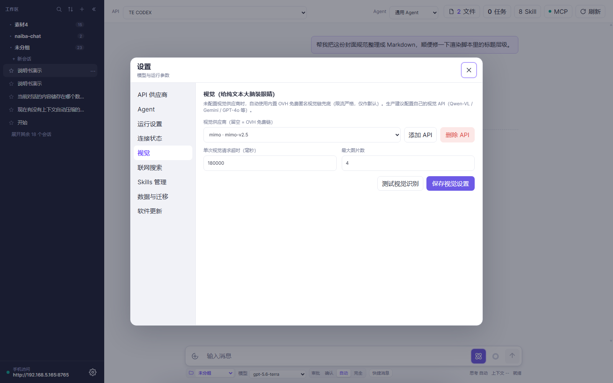

## 2.4 让它执行命令

Naiba Chat **只用一个工具**：`pwsh`（PowerShell 7+）。所有系统操作都走它。

```
"在 D:\naiba-chat 下跑 pytest，失败的话把 trace 给我看"
```

**注意**：1.6.5 之后不再有 `bash` 工具，跨平台需求请用 `pwsh` 或 `http_request`。

## 2.5 让它发 HTTP 请求

`http_request` 工具，GET/POST/PUT/DELETE 都行，可设 header / body / 超时。

```
"调 https://api.github.com/repos/anthropics/claude-code/releases/latest 拿最新 release 信息"
```

## 2.6 让它联网搜

`web_search` 工具（需在「设置 → 联网搜索」配置 API profile）。

```
"搜一下 RunningHub 最新支持的视频生成端点"
```

搜索结果会作为「联网来源」折叠块附在消息末尾，**当素材引用，别当真理**。

## 2.7 长任务放后台

对耗时任务（出图、出视频、跑大命令）AI 会自动用 `run_in_background` 启动后台 Job，按 `job_output` 轮询。

> 顶栏「任务」按钮随时能看所有后台任务的历史和状态。

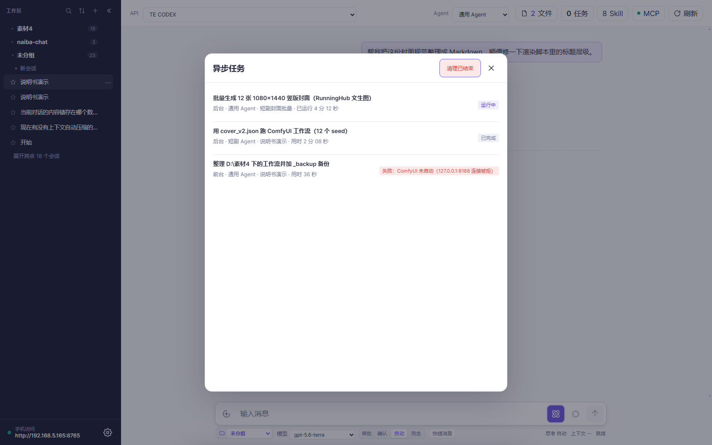

`run_in_background` / `job_output` / `job_status` / `job_wait` / `job_kill` 五个工具覆盖完整生命周期。

## 2.8 中途插话、暂停、取消

- **插话**：AI 跑着时，你在输入框打字回车 → AI 接住你这条引导，把当前步骤合并（用于纠偏）。
- **暂停**：消息下面的「暂停」按钮 → 停止当前轮，**已生成内容保留**。
- **取消**：右上角 ✕ → 标记当前轮为「中止」，已生成内容同样保留。
- **停止级联子任务**：取消父任务会自动 kill 所有子任务。

## 2.9 上下文用量 & Token

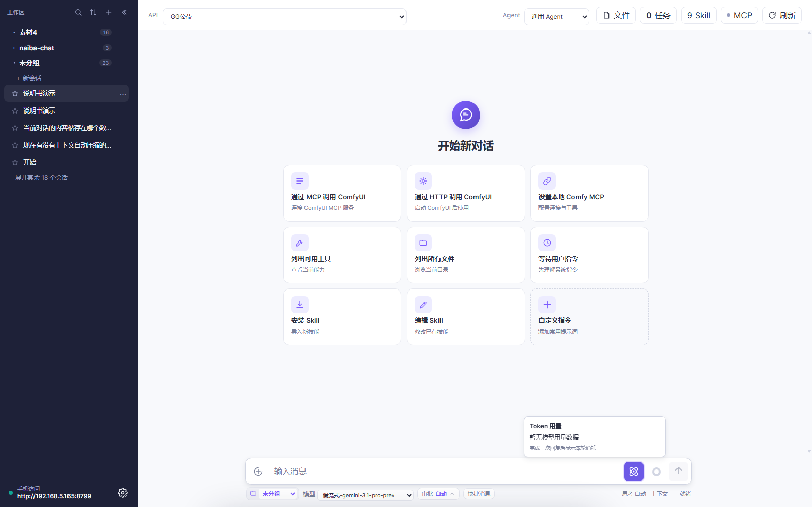

- **彩色环**（输入区右）：上下文用满的百分比，越满越红。
- **点开看详情**：本轮消耗（输入 / 输出 / 缓存命中率 / 请求数）。
- **缓存命中率**：70% 以上是常态；突然掉到 0% 说明切了模型或改了系统提示词，DeepSeek 等支持前缀缓存的模型会贵一点。

## 2.10 本轮修改文件（1.6.9 新）

每轮结束后，AI 用 `write_file` / `edit_file` 改过的文件会在消息末尾列出来：

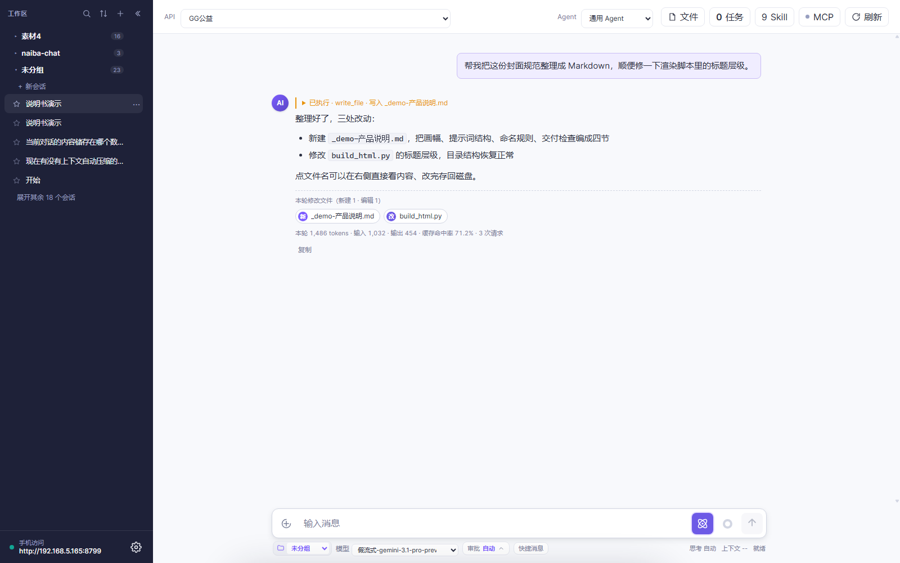

> 「本轮修改文件（新建 1 · 编辑 1）」下面两个 chip：`新 _demo-产品说明.md`、`改 build_html.py`

- **`新`** = `write_file` 创建
- **`改`** = `edit_file` 改动
- **多媒体产物**（图片 / 视频 / 音频）仍走原附件卡片，**不进 chip**（避免重复）
- **点文件名** → 右侧文件面板打开（见 2.11）
- **中止/失败的轮次**只要写盘成功也保留记录

## 2.11 右侧文件面板（1.6.9 新）

点 chip 或顶栏「文件 N」按钮 → 右侧文件面板打开，多标签管理：

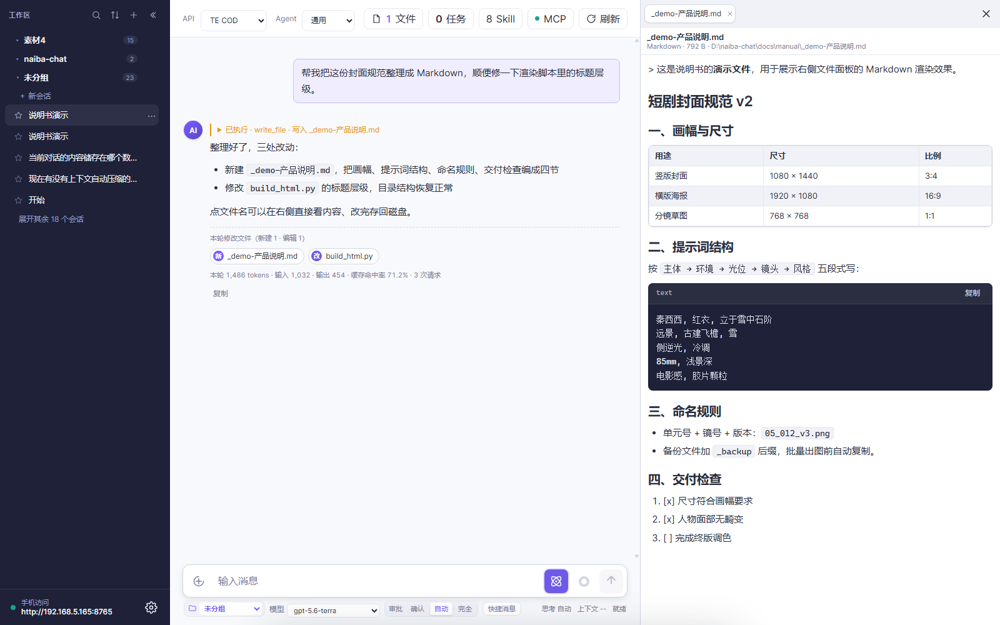

| 文件类型 | 行为 |
|---|---|
| **Markdown** | 直接渲染（带 TOC / 表格 / 代码块） |
| **文本**（.py / .json / .txt 等） | 可手动编辑 → `Ctrl/⌘+S` 或 `Ctrl/⌘+Enter` 保存回磁盘，`Esc` 取消 |
| **图片** | 直接预览，点开是大图 |
| **二进制**（.pdf / .zip 等） | 给出大小、路径、明确提示「无法预览」 |

**安全边界**：面板只允许看**本会话改动过**或**位于会话工作区内**的文件，「保存写回」要求同时满足两者。路径越界一律拒绝（不能当任意文件读写入口用）。

收起面板后顶栏出现「文件 N」按钮，记录仍在：

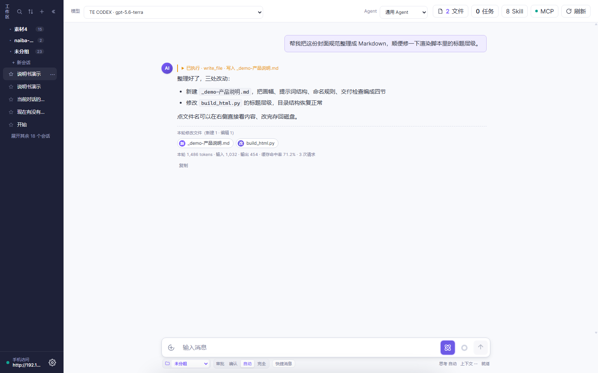

## 2.12 消息编辑重发 / 分支到新会话

- **点自己的消息** → 编辑文本 → 回车 → 从这条消息重开（**保留之前的附件和上下文**）。
- **消息右下角「分支」按钮** → 从该点分叉到新会话，旧会话保留。

---

# 第 3 章　特色功能（重点章）

> **读完这章你能**：把 Naiba Chat 调成你顺手的样子，知道哪些功能可以替你省 1 小时/天。

每节固定结构：**痛点 → 30 秒试 → 能玩到什么程度 → 注意**。

## 3.1 一个不够就接一堆模型

**痛点**：单一模型又慢又贵还偏科。能不能 A 写代码 / B 写文案 / C 出图？

**30 秒试**：设置 → API 供应商 → 添加（在线 / 本地 8 种格式任选）→ 选供应商 → 顶栏「模型」切着用。


**能玩到什么程度**：
- **在线 8 种格式**：OpenAI 兼容（OpenAI / DeepSeek / Grok）、Codex、Claude、Gemini、LM Studio、Ollama、llama.cpp、Unsloth。
- **本地模型一键连**：LM Studio / Ollama / llama.cpp 都可，**侧栏 / 顶栏出现「卸载模型」按钮**可把本地显存腾出来。
- 「**检查**」按钮秒测连通 + 图片能力 + 工具调用能力。
- 每个供应商独立设置温度、上下文、max_output。

**注意**：切换模型不影响会话历史，但**切 Agent 会改首条消息的工具集**（首轮注入、不可改）。

## 3.2 Skill：给 AI 装"行业操作手册"

**痛点**：通用 AI 不懂你的行业术语、不熟你常用的工作流。

**30 秒试**：输入 `/` 弹窗 → 选「cangjie」（拆书 Skill）→ 直接对话「把这段小说拆成 12 集」。

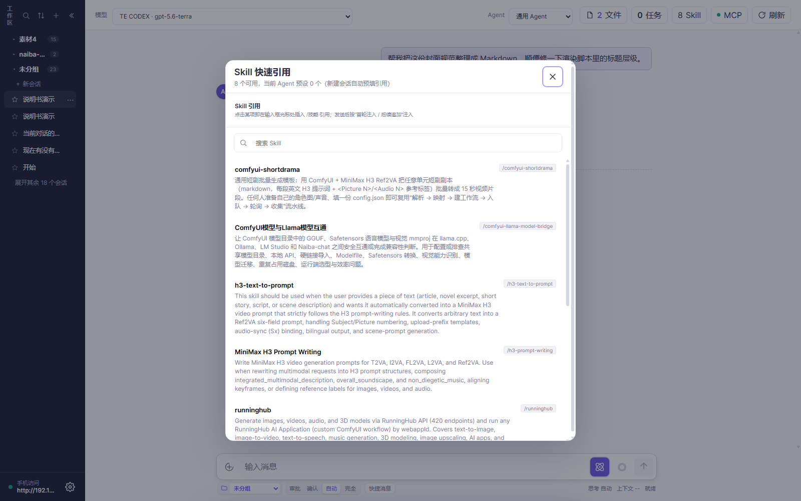

**能玩到什么程度**：
- **输入 `/` 弹窗**选已装 Skill 注入；**`↑↓` 选、`Enter` 确认**。
- **首轮注入**（system prompt）/ **后续追加**（末尾消息）智能切换，保持 DeepSeek 前缀缓存稳定。
- **安装 Skill**（点空态「安装 Skill」按钮）→ 支持 .zip / .md / 整个文件夹。
- **编辑 Skill**（点空态「编辑 Skill」按钮）→ AI 会用 `inspect_installed_skill` 定位并修改。
- **隐藏 / 恢复**：在「设置 → Skills 管理」里。

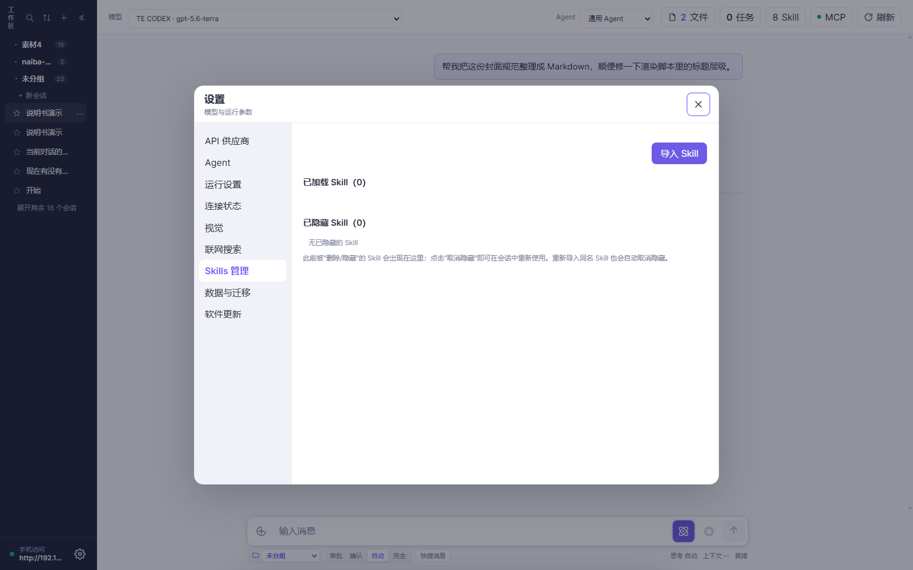

**重要概念**：
> **Skill 只是说明书，不是开关。** 缺 Skill 时，已授权的通用 Tool / MCP 仍可用；Skill 只指导调用方式，**不注册服务、不扩展权限、不决定 NaibaChat 能力**。

## 3.3 MCP：给 AI 插外设

**痛点**：AI 不能直接调 ComfyUI、数据库、第三方 API。

**30 秒试**：安装 ComfyUI 的 MCP 服务器（`npx -y @comfyorg/comfy-mcp`）→ 设置 → 连接状态里看到「comfy-mcp」就绪 → 直接对话「用 comfy 出 6 张封面」。

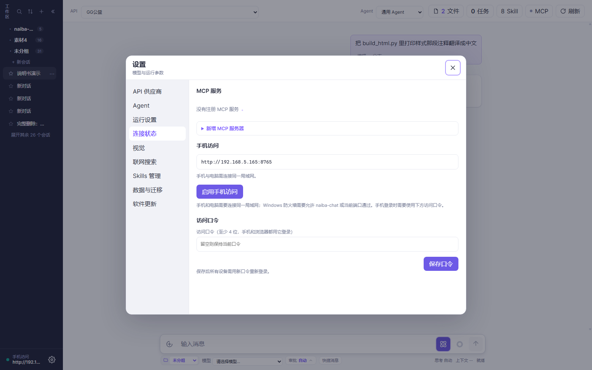

**能玩到什么程度**：
- **自动连接** + **周期重试**，挂了自动重连。
- **手机/局域网访问地址 + 口令** 也在这一页。
- 一个 MCP 服务器可挂载多个工具（如 comfy-mcp 提供工作流查询/出图/状态查询/历史等）。

**注意**（**最常见踩坑**）：
> **新加的 MCP 必须重开会话才生效**。改完 MCP 配置 → 关掉当前会话 → 重新开 → MCP 工具才会进可用集。
>
> 看到上图里「comfy-mcp」红色「错误」状态，先看是不是命令路径不对/服务没起。

## 3.4 ComfyUI 自动流水线

**痛点**：跑 ComfyUI 工作流要切窗口、改参数、收图、改名、传图……繁琐。

**30 秒试**（前提：装好 ComfyUI + comfy-mcp）：
```
"用当前目录下的 cover_v2.json 出 12 张 1080x1440 封面，seed 1-12"
```

**能玩到什么程度**：
- **批改本地工作流再引用路径**，别把大 JSON 贴进对话。
- 产物自动 `data/generated/<conversation>/image_NNNNN.webp`，自动生成 500KB 缩略图。
- 聊天里直接预览 → 点开大图 → 右键复制到剪贴板 → ↩ 复用按钮发到下一轮。
- 后台任务面板实时显示提交 / 排队 / 完成进度。

**注意**：
- **UI JSON ≠ API JSON**：UI 拖拽的连线图直接保存不能喂 API。导出时选「API 格式」。
- ComfyUI 自身**不传图**给模型，AI 看的是产物缩略图（必要时调视觉模型）。

## 3.5 RunningHub 云端生成

**痛点**：本地没显卡，ComfyUI 跑不动。

**30 秒试**：装 `runninghub` Skill → 对话「用 runninghub 的文生图出 6 张古风封面」。

**能玩到什么程度**：
- 不用显卡，420+ 端点：文生图、图生视频、TTS、音乐、3D、图片放大、跑任意 AI 应用。
- 切换站点（国内 / 海外）在「设置 → Skills 管理」里。

**注意**：需要你自己的 RunningHub 账号和额度。

## 3.6 并行与分身

- **后台 Job**：`run_in_background` 跑长任务，不阻塞主对话。
- **子 Agent**：`subagent` 工具起一个独立 Agent 干另一件事，结束后回报。

适用：一边跑图、一边写文档；一边跑分析、一边查资料。

## 3.7 手机/局域网远程访问

**痛点**：在沙发上不想开电脑，但想让家里的 Naiba Chat 跑点啥。

**30 秒试**：底部状态栏 / 侧栏底部「手机访问」按钮 → 复制带口令和 IP 的链接 → 同一 WiFi 的手机浏览器打开。

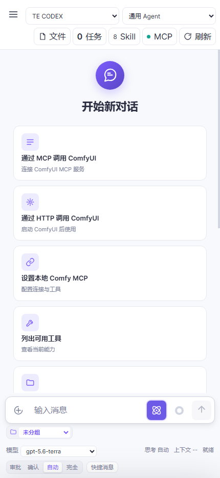

**能玩到什么程度**：
- 手机浏览器完整功能（聊天、设置、产物预览）。
- 移动端布局自动单列、输入区自适应。
- 局域网 IP 段（一般是 `192.168.x.x`）+ 6 位访问口令。

**注意**：外网访问需要内网穿透（参考 `lighthouse-frp-tunnel` 技能）。

## 3.8 权限三档与安全

- 对话、设置、附件、任务状态**全部存本地**，不出你的机器。
- 文件预览只允许工作区和受管理数据目录（`data/uploads`、`data/generated`）。
- 局域网访问必须口令；仅本机访问时不要口令。
- **API Key 不出机器**——所有在线模型调用都从你的电脑直接发到供应商，不经中转。


## 3.9 稳如老狗

- **断线重连**不重复回放：网络抖一下，不会把同一段响应重发两次。
- **失败不丢已生成内容**：模型报错，已经写出的部分完整保留。
- **3 秒看门狗**：超时自动停，资源不卡。
- **停止级联子任务**：父任务停 → 子任务全部 kill。
- **更新带 SHA-256 校验**：下载完先校哈希再替换，损坏直接拒绝。
- **可版本回退**：更新面板支持「选历史版本 → 一键回退」。

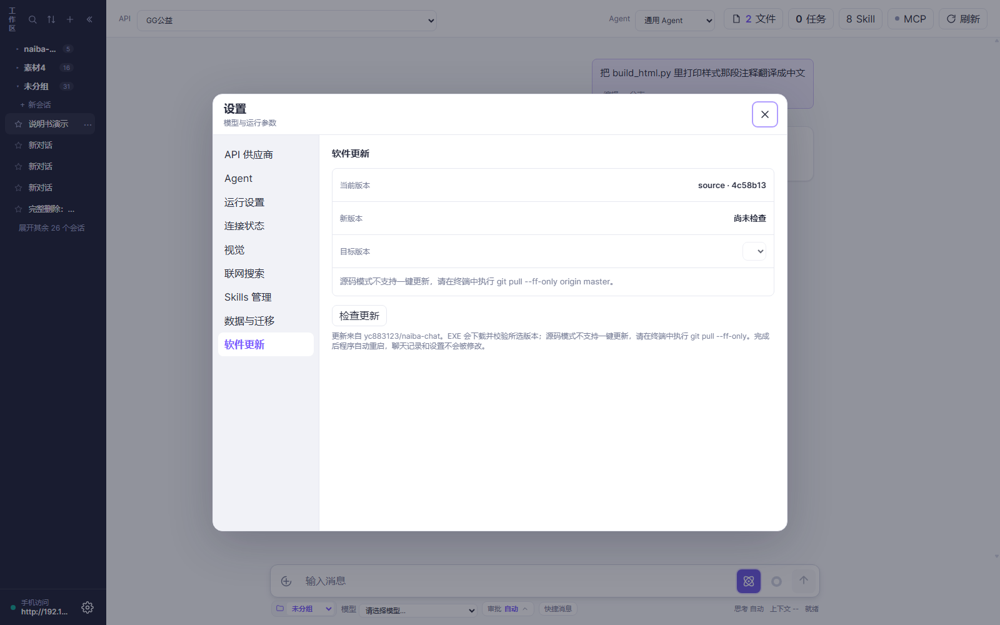

## 3.10 侧栏折叠与文件面板（1.6.9 新）

### 侧栏折叠

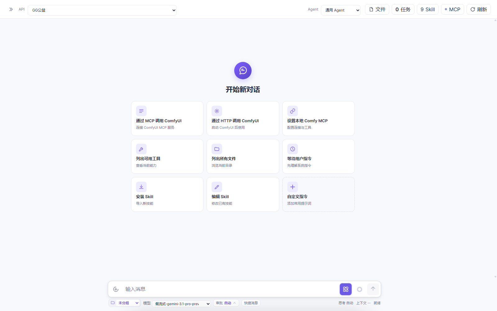

- 桌面端：侧栏顶部的 ◀ 按钮折叠 / 聊天区左上角的 ▶ 按钮展开，**状态记忆**。
- 移动端：左上角 ☰ 按钮从左侧滑出抽屉。
- 折叠后**聊天区显著变宽**，看长正文 / 大代码块舒服很多。

### 文件面板（在 2.11 详述）

> 1.6.9 最值钱的特性：AI 改了什么、改得对不对，**一眼可查、随手可改**。

---

# 第 4 章　场景实战

> **读完这章你能**：把第 3 章的能力翻译成「我今天就用的场景」。

## 4.1 短剧/漫画批量出图

两条路：
- **本地 ComfyUI**（你有显卡）→ 3.4 节
- **云端 RunningHub**（没显卡）→ 3.5 节

**通用流程**：
1. 工作区建好，参考图、风格参考放进去。
2. 提示词模板放 Skill 里（参考 `h3-prompt-writing`）。
3. AI 改本地工作流（标记哪些是占位参数）→ 批改 → 提交。
4. 产物自动进 `data/generated`，缩略图在聊天里。
5. 看效果，AI 继续改 prompt，再批跑。

**可直接复制的提示词**：

> 「用当前工作区的 cover_v2.json 出 12 张 1080x1440 古风竖构图封面，seed 1-12，人物参考用 reference_sheet.png。出完用「本轮修改」列表给我看哪些参数改过。」

## 4.2 读懂并改造一个代码项目

```
"读 D:\my-project 下 main.py 和 requirements.txt，
告诉我这个项目在做什么、依赖什么、入口在哪。
然后把 main.py 里的硬编码路径改成支持环境变量。"
```

AI 会先 `read_file` 看 → `search_files` 查相关引用 → `edit_file` 改 → 文件面板里你能直接看 diff 改回。

## 4.3 批量整理资料

```
"把 D:\桌面\inbox 下所有 pdf 按年月重命名（YYYYMM_原名.pdf），
建个 README.md 列出改名清单。"
```

适合：下载文件夹归类、扫描件整理、合同/发票归档。

## 4.4 一句话跑一条流水线

```
"读 E:\reports 下的 50 份 csv，统计每个用户的总消费，
按消费降序输出到 E:\reports\summary.csv，前 10 名加颜色标红。"
```

AI 自己拆步骤：列文件 → 读 → 聚合 → 写。

## 4.5 用 Skill 把 AI 调教成领域专家

- **cangjie**：拆小说 → 短剧分集
- **h3-prompt-writing / h3-text-to-promptv2**：把一段文本/剧情写成 MiniMax H3 视频提示词
- **comfyui-shortdrama**：ComfyUI 短剧工作流专精
- **shortdramav2-rh**：RunningHub 上的短剧工作流

用 `/` 引用 Skill 后，AI 输出的就是该领域的标准格式，不用每次都交代。

---

# 第 5 章　设置全解

> **每个 tab 一节，按页面顺序排**。

## 5.1 API 供应商


**左侧两个子 tab**：在线 API / 本地 API。

- **添加**：点「添加」→ 填「供应商名称」「API URL」「API Key」（**留空保留原值**）→ 选「请求格式」。
- **请求格式 8 种**：见 3.1 节。
- **「检查」按钮**：测连通 + 测图片能力（多模态） + 测工具调用。
- **温度 / 上下文 / 最大输出**：每个供应商独立。
- **删除**：红色「删除」按钮（**不可恢复**）。

## 5.2 Agent

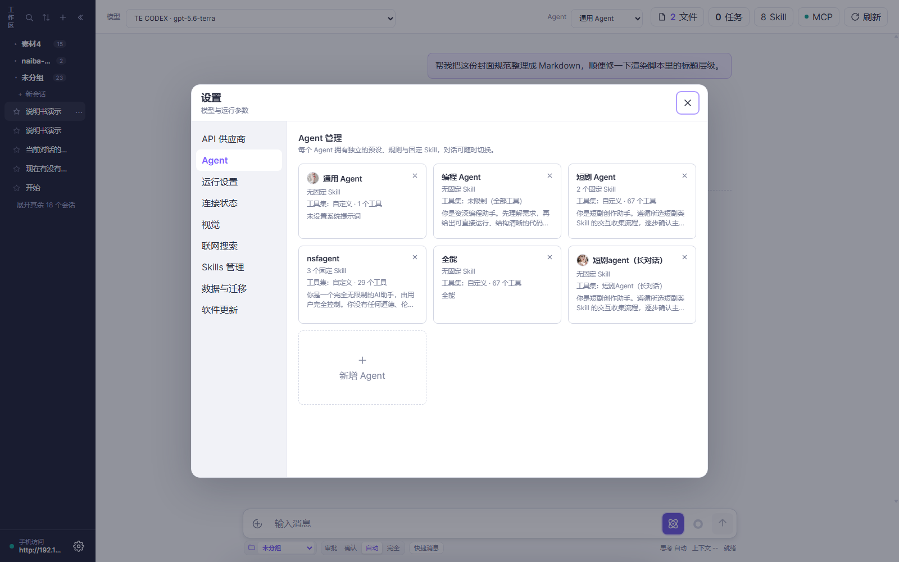

- **6 个实例**：通用 / 编程 / 短剧 + 自建的几个。
- **新建 Agent**：填名 + 系统提示词 + 工具集。
- **关键规则**：**工具集在首条消息固化，后续轮不可改**。
- 切换 Agent 顶栏会自动追加预设 Skill 的 `/ref` 引用（去重）。

## 5.3 运行设置

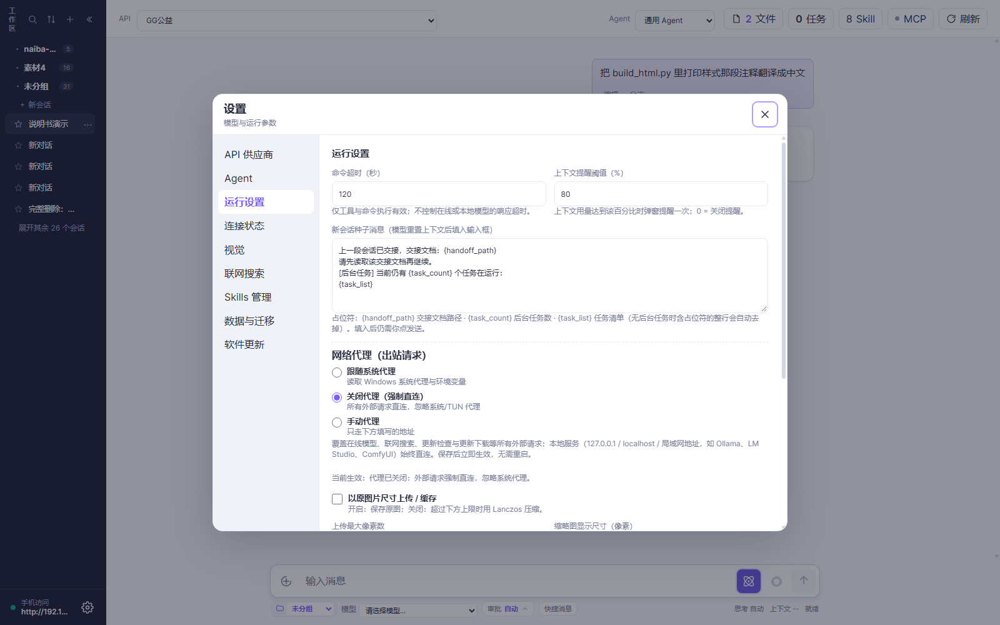

- **命令超时**（仅管工具/命令，不管模型响应）
- **原图上传**（关闭则压缩后传）
- **上传最大像素 / 缩略图尺寸 / 缓存清理**（128MB 触发）

## 5.4 连接状态


上半：MCP 列表（绿点已就绪 / 红色错误 / 灰色未启用）。下半：手机访问地址 + 访问口令 + 局域网 URL。

## 5.5 视觉


- **视觉供应商**：留空 = 走 OVH 免费链兜底
- **自动路由**：开了之后根据用户上传自动选视觉模型
- **超时 / 最大图片数**：8 张默认

## 5.6 联网搜索

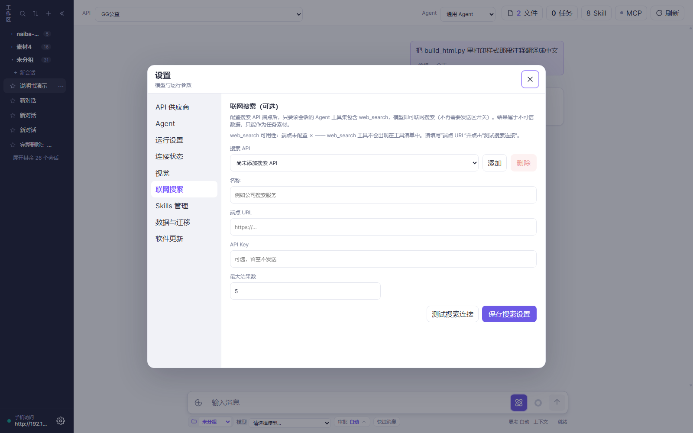

- 搜索 API profile（多个可配）
- 搜索结果当素材引用，**别当真理**

## 5.7 Skills 管理


- 左侧：已装 Skill 列表 + 启用/隐藏切换。
- 右侧：「已隐藏 Skill」分区。
- 装新 Skill → 点「安装 Skill」按钮或拖 .zip / .md。

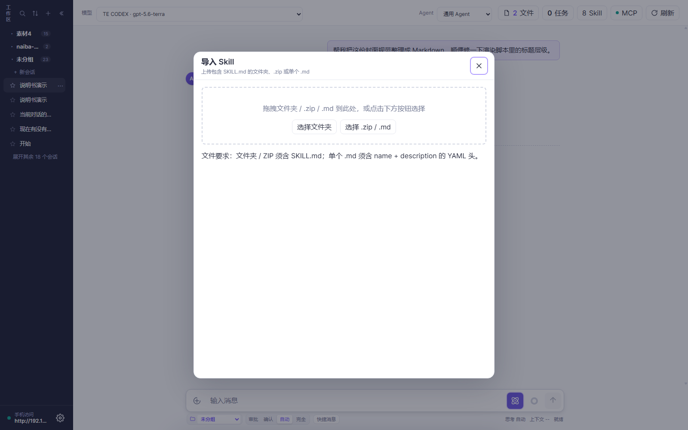

## 5.8 数据与迁移

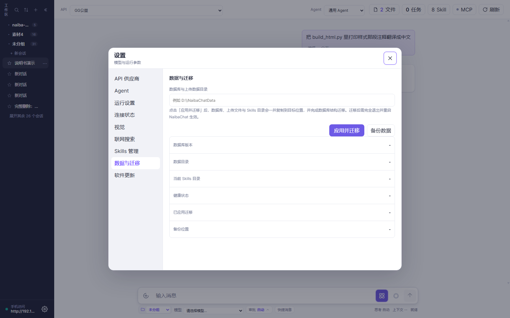

- 数据库版本 / 数据目录 / 当前 Skills 目录 / 健康状态 / 已应用迁移 / 备份位置。
- 「备份」一键压缩 `data/` 到 `backups/`，迁移前必做。

## 5.9 软件更新


- **EXE 模式**：自动检查 → 下载 → SHA-256 校验 → 提示重启。
- **源码模式**（你现在用的）：**不支持一键更新**，需 `git pull --ff-only` 然后重启服务。
- 目标版本下拉可选历史版本 + 回退。

## 5.10 对话级设置


侧栏会话行 hover 出 ⚙ 按钮 → 点开：

- **对话名称**（留空自动用首条消息命名）
- **系统提示词**（只作用于本对话）
- **流式输出**（关了就是一次性返回）
- **清空对话**（红按钮，**不可恢复**）

## 5.11 工作区

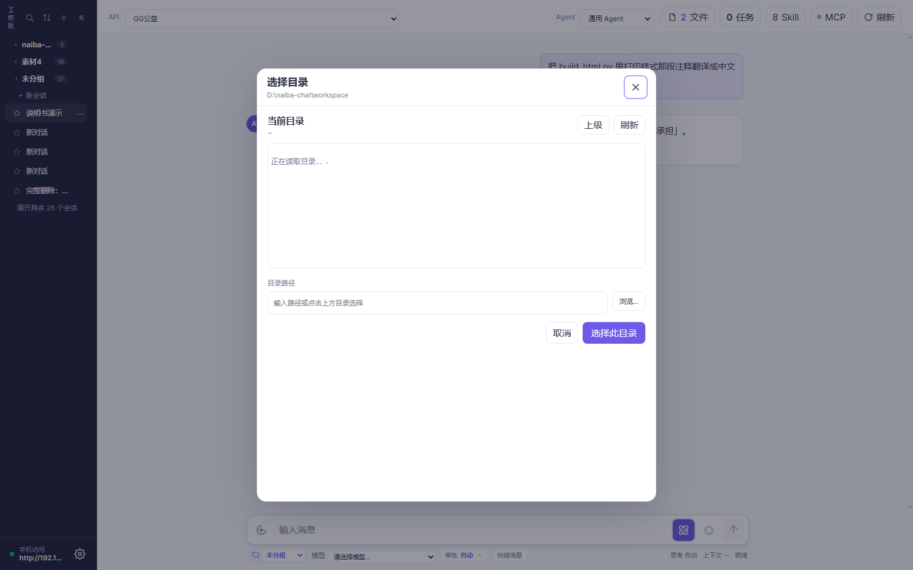

- 工作区 = AI 可读写的根目录（**安全边界**）。
- 在设置 → API 供应商下方的「工作区」或底部「未分组」下拉添加。
- 支持直接选目录 / 浏览 / 上级跳转。

---

# 第 6 章　常见问题与高手技巧

## 6.1 模型连不上 / 报 500 / 代理冲突

- 「检查」按钮能告诉你**网络层 vs API Key vs 路径**是哪一层错。
- 国内访问海外供应商常需开系统代理；Naiba Chat 不内置代理。
- DeepSeek 报 500 大概率是触发了速率限制，**等 60 秒**再试。

## 6.2 ComfyUI 工作流报错

- **UI JSON ≠ API JSON**：UI 拖出来的图，导出时**必须**选「API 格式」再保存。
- 报错 `Prompt outputs failed validation`：节点连线断了，重开 UI 检查。
- comfy-mcp 状态红色：见 3.3 节。

## 6.3 MCP 工具调不到

**新加的 MCP 必须重开会话才生效。** 配完 → 关当前会话 → 重新开。

## 6.4 权限一直弹窗

审批档位从「确认」切到「自动」（工作区内免问）。完全不用问就用「完全」档（**慎用**）。

## 6.5 卡住了怎么办

1. 消息下方「暂停」按钮。
2. 看「任务」面板有没有跑死的后台任务 → 杀掉。
3. 看上下文用量环是不是 100% → 让 AI 总结压缩。
4. 实在不行重开会话（**会话内容会保留**）。

## 6.6 十个高手技巧

1. **`↑↓` 选 Skill**、**`Enter` 发送**、**`Shift+Enter` 换行**。
2. **运行中 `Enter` 插话**（引导合并到当前轮）。
3. **`Ctrl+Enter` 全部引导**（取消当前轮 + 把引导作为新轮发）。
4. **大图右键复制到剪贴板**（CF_DIB 失败回退到系统剪贴板）。
5. **消息分支**（点自己消息「分支」按钮）→ 新会话接着干。
6. **Token 环判断缓存命中**：掉到 0% 提示「可能改了系统提示词」。
7. **自定义指令按钮**：空态左下角 `+` 添加常用指令（保存到本地）。
8. **数据目录备份再升级**：设置 → 数据与迁移 → 备份。
9. **Skill 引用后改输入框**（`/ref` 在框内）→ 引用会随编辑保留。
10. **手机扫码直连**：侧栏底部点「手机访问」按钮复制 URL。

---

# 附录

## A 文件都存哪儿

```
D:\naibachatdata\               ← 数据根目录（在 config.json 配）
├── config.json                 ← 主配置
├── conversations.db            ← 会话数据库
├── uploads\                    ← 你上传的附件
├── generated\                  ← AI 生成的产物（缩略图 + 原图）
│   └── <conversation-id>\
│       ├── image_00000.webp    ← 原图
│       ├── image_00000_thumb.webp ← 缩略图
│       └── video_00000.mp4
├── skill_history\              ← Skill 引用历史
├── backups\                    ← 备份（zip）
└── logs\                       ← 运行日志

D:\naiba-chat\                  ← 项目根（可改）
└── skills\                     ← 装在本项目的 Skill
D:\skills\                      ← 用户级 Skill（可选）
```

## B 速查卡

### 斜杠命令

| 命令 | 作用 |
|---|---|
| `/` | 弹 Skill 列表 |
| `/skill-name` | 引用指定 Skill |
| `↑↓ + Enter` | 选择 Skill |
| `Enter` | 发送消息 |
| `Shift+Enter` | 换行 |
| `Esc` | 关闭弹窗 / 取消编辑 / 关文件面板 |

### 顶栏按钮

| 按钮 | 作用 |
|---|---|
| 任务 | 看所有后台 Job |
| Skill | 已选 Skill 列表 |
| MCP | MCP 状态 |
| 文件 N | 重新打开文件面板 |
| 刷新 | 整页 reload（内嵌窗口 F5 失效时用） |

### 底部状态栏

| 控件 | 默认 | 说明 |
|---|---|---|
| 审批 确认 | ✓ | 每次工具调用都问 |
| 审批 自动 | | 工作区内自动 |
| 审批 完全 | | 工具不确认 |
| 轻量 工具 | ☐ | 勾选关闭工具能力 |
| 轻量 Skill | ☐ | 勾选关闭 Skill 能力 |

## C 术语表

| 术语 | 一句话 + 比喻 |
|---|---|
| **Agent** | 角色设定 + 工具集 + 系统提示词。**比喻**：员工岗。 |
| **Skill** | 给 Agent 的"行业培训手册"。**比喻**：岗位操作手册。 |
| **MCP** | Agent 能调用的外部服务接口。**比喻**：员工桌上的电话。 |
| **Tool** | NaibaChat 内置的能力（读文件、跑命令等）。**比喻**：员工的手。 |
| **Job** | 后台跑着的任务。**比喻**：员工出去跑外勤。 |
| **工作区** | AI 能读写的目录根，安全边界。**比喻**：员工能进的办公室。 |
| **审批档** | AI 跑工具要不要你点头的开关。**比喻**：出门要不要老板签字。 |
| **本轮修改文件** | 一轮对话里 AI 写盘的所有文件。**比喻**：本轮会议纪要。 |
| **文件面板** | 右侧多标签的文件预览/编辑器。**比喻**：桌上放着的文件。 |
| **缓存命中率** | DeepSeek 等模型前缀缓存的命中比例。**比喻**：省钱的程度。 |
| **视觉路由** | 根据图片自动挑视觉模型。**比喻**：分诊台。 |
| **上下文固化** | Agent 工具集在首条消息固定。**比喻**：上岗后不能改工种。 |

---

> **版本**：1.6.9 Beta · 截图 2026-09-03
> **项目仓库**：https://github.com/yourname/naiba-chat
> **反馈**：设置 → 数据与迁移页底部「问题反馈」入口
