# Naiba Chat 应用说明书（2.2.0 Beta）

> 本说明书面向「第一次打开 Naiba Chat」的小白读者，配图全部来自真实运行界面（2.2.0 Beta · 源码模式 · 截图 2026-09-10）。

---

## 阅读路径

- **只想聊天** → 看第 1～2 章
- **想玩花的** → 重点看第 3 章
- **想查设置** → 直接翻第 5 章
- **出问题** → 第 6 章

---

## 亮点速览（用 30 秒了解 Naiba Chat 能干什么）

1. **🆕 2.2.0 手机端功能对等**：手机不再少半截——文件面板变**全屏抽屉**、「本轮修改的文件」恢复可点、桌面刻度轨换成顶栏**「轮次」下拉**，触摸目标统一 ≥44px。
2. **🆕 2.1.1 每个会话单独选模型**：顶栏选「API」（去哪儿），输入区选「模型」（派谁干），**按会话记忆、分支继承**，换完还自动重新探测图片能力。
3. **长会话不会越聊越贵（2.1.0 头牌）**：聊到上下文快满时划一条「新会话」分割线，线以上的老消息不再发给模型，**聊天记录一条不删**，还能让模型自己写交接文档再重置。
4. **一个不够就接一堆模型**：OpenAI 兼容 / Anthropic / Gemini / Ollama / LM Studio / llama.cpp / Unsloth……在线本地都能接。
5. **Skill：给 AI 装"行业操作手册"**：写小说、跑 ComfyUI、写视频提示词……用 `/` 一键把领域知识塞进对话。
6. **MCP：给 AI 插外设**：ComfyUI、文件、网页……只要 MCP 服务器在跑，AI 就能直接调用。
7. **ComfyUI 自动流水线**：批改工作流 → 批量提交 → 自动收图 → 缩略图预览 → 一句话复用到下一轮。
8. **RunningHub 云端生成**：没显卡也能出 420+ 类型的图、视频、音频、3D。
9. **并行与分身**：后台 Job + 子 Agent，任务互不阻塞，跑图的时候还能写稿。
10. **手机/局域网远程访问**：同 WiFi 打开链接，躺床上也能用家里电脑。
11. **稳如老狗**：断线重连不重放、失败不丢已生成内容、5xx/429 自动重试、SHA-256 校验更新、可版本回退。
12. **文件面板 + 本轮修改文件**：AI 改过的文件直接在右侧看、可编辑、可存回磁盘，**改了什么一目了然**。

---

# 第 1 章　三分钟跑起来

> **读完这章你能**：自己装好 Naiba Chat、配上一个能跑的模型、发第一句对话。

## 1.1 它到底是什么

Naiba Chat 不是聊天框，是装在你电脑上的 **AI 工作台**——它能跟你对话，更能直接动手：读你的文件、改你的代码、跑你的命令、上网搜资料、出图出视频。**所有数据留在本地**，API Key 不出机器。

一句话比喻：**你雇了一个员工（Agent），给他配了工位（工作区）、工具箱（Tools）、行业手册（Skill）和外线电话（MCP），他干完活会把改过的文件摊在你桌上（文件面板）让你验收。**

## 1.2 下载、解压、双击

1. 去 GitHub Releases 页面下载 `naiba-chat-2.2.0-beta-windows-x64.zip`。
2. **解压到可写目录**（桌面 / D 盘 / 工作盘都行，**不要放 `C:\Program Files`**，需要写权限）。
3. 双击 `naiba-chat.exe`（或源码模式直接 `python server.py`）。
4. 浏览器自动打开 `http://127.0.0.1:8765`，看到主界面就成功了。

> 从源码跑：`python -m pip install pywebview pystray pillow "mcp==2.1.1" pymupdf python-multipart`，然后 `python server.py`。

## 1.3 第一次打开要做的四件事

> **本机访问免口令**；手机/局域网访问要口令（在「设置 → 连接状态」页查看）。

1. **添加一个 API** → 顶栏 ⚙ 设置 → 「API 供应商」→ 点「添加 API」卡片 → 填地址 / Key / 模型名 → 点「检查」测连通。

   

2. **选一个 Agent** → 顶栏「Agent」下拉里选一个（Agent = 人设 + 系统提示词 + 工具集）。

3. **选这个会话要用的模型** → 顶栏「API」下拉选刚才加的连接，**输入框下方左边「模型」下拉**（列表就是该 API 的模型目录）选一个。

   

4. **发第一句话** → 底部输入框打字 → 按 `Enter` 或点 ↑ 发送。

> **没配过模型？** 主界面空态里已经放了常用指令卡片（点一下就发），新手按顺序点「列出可用工具」试试水。

主界面长这样：


## 1.4 界面 30 秒认识

| 区域 | 你能干什么 |
|---|---|
| **顶栏左** | 展开/收起侧栏（状态会记住） |
| **顶栏中** | 切 **API**（连接配置）、切 Agent（两个下拉） |
| **顶栏右** | 文件 / 任务 / Skill / MCP 状态 / 刷新 |
| **左侧栏** | 工作区分组、会话列表、底部「已收藏」分组 |
| **中间聊天区** | 对话、思考块、工具块、产物、本轮修改文件、**新会话分割线** |
| **聊天区右侧** | **对话刻度轨**：一轮一条横条，点一下跳到那一轮 |
| **右侧文件面板** | AI 改过的文件在这里多标签预览/编辑 |
| **底部输入区** | 附件列表 / 添加文件 / 思考强度 / 上下文圆环 / 发送 |
| **底部状态栏** | **模型下拉**（本会话用哪个模型）、工作区下拉、**审批按钮**（点开是三档上拉框）、快捷消息 ｜ 右侧：思考强度、上下文百分比、就绪状态 |

## 1.5 你必须知道的三个开关

### ① 审批档位（2.2.0 改为上拉框）

底部左侧的「**审批**」按钮，决定 AI 跑工具要不要你点头。**收起时它只是一个按钮**（显示当前档位，风险越高颜色越醒目），**点一下**才在按钮上方弹出三档列表：


- **确认**（默认）：每次工具调用都弹「需要确认」卡片 → 你点「允许执行」才跑（**最安全**）。
- **自动**：工作区内自动放行；工作区外（**读也算**）仍会停下弹确认卡。
- **完全**：不再询问，可访问工作区外（**最省事，但写错可能毁文件**）。

选完、切换会话、打开别的浮层、按 `Esc`、点外面，列表都会收起。工作区外写操作时会停下弹确认卡：

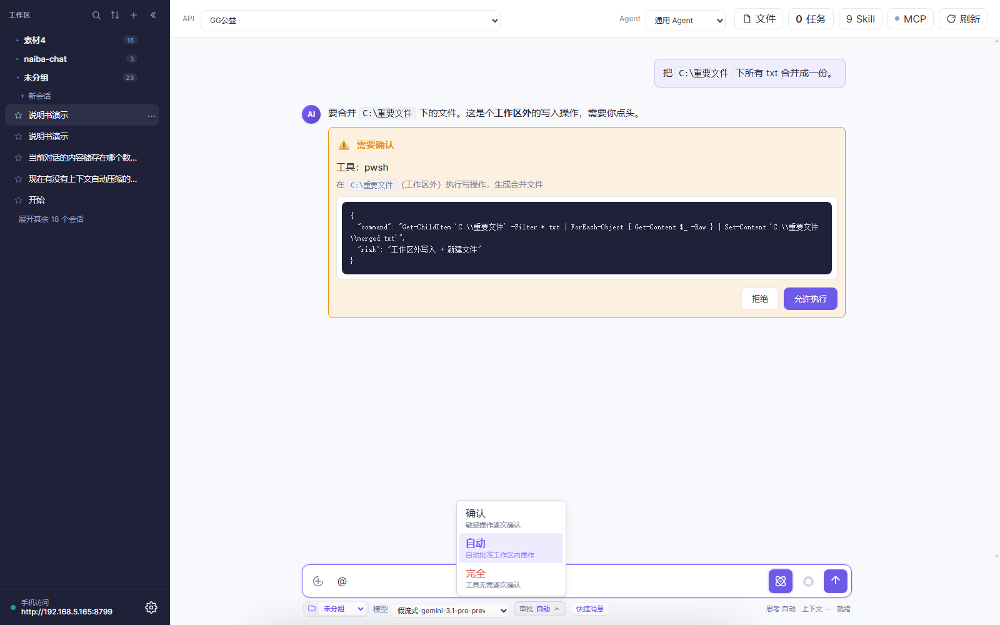

> 2.1.0 起没有「轻量 / 富文本」开关了——**AI 能用哪些工具完全由 Agent 的工具集决定**，不再有会话级开关。想收窄能力，去「设置 → Agent」里改工具集。
>
> 2.2.0 把这个控件从「平铺四段」改成上拉框，省出的横向空间留给工作区和模型选择器；窄屏也不会被挤变形。

### ② 深度思考


输入区右侧的球形按钮，点开有 5 档：

- **跟随 API（自动）**——按模型自身行为
- **关闭**——直接答，不思考
- **低 / 中 / 高**——强制思考强度

当前档位常显在输入框下方（「思考 自动」）。模型支持时（DeepSeek-R1、Claude、o 系列）才有效，否则忽略。

> 2.1.0 改动：点这个按钮**只展开/收起列表**，不会再顺手帮你切档。

### ③ 上下文提醒

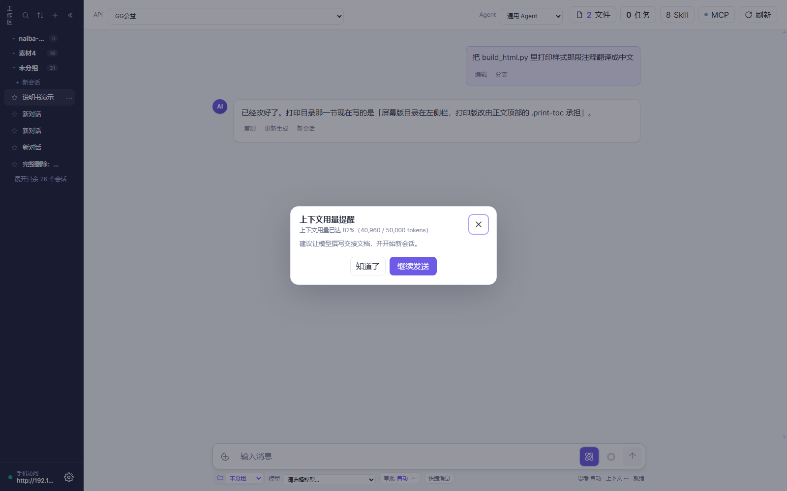

输入框右侧的彩色圆环 + 下方常驻的「上下文 x.x%」就是上下文用量：

- 每次模型请求后刷新，70% 转黄、90% 转红，鼠标悬停看 `已用 / 上限`。
- 超过阈值（默认 80%，在「设置 → 运行设置」改，填 0 关闭）会弹窗提醒，建议让模型写交接文档并开始新会话。
- 隔 5 个百分点才提醒第二次，不会一直弹。

---

# 第 2 章　一次对话能干什么

> **读完这章你能**：让 AI 读你的文件、改你的代码、跑你的命令、出你的图，而且知道每一步在背后发生了什么。

## 2.1 普通问答

直接在输入框打字发就行。AI 拿到的是你**当前会话的上下文**（Agent 系统提示词 + 历史消息 + Skill + 工具结果）。一条典型的「思考 → 工具 → 正文」交错长这样：

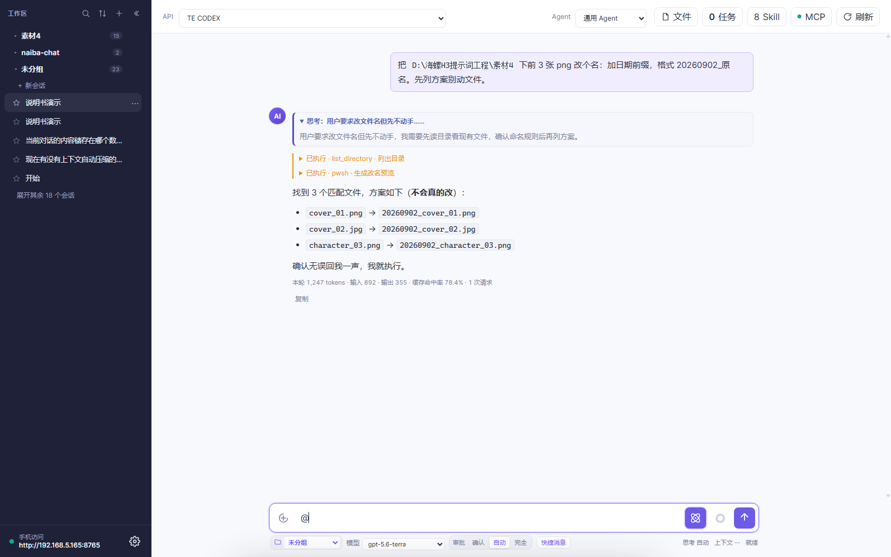

## 2.2 让它读 / 写 / 搜文件

| 你说的话 | AI 用什么 |
|---|---|
| 「读一下 README.md 头三行」 | `read_file` |
| 「把 build_info.json 的 version 改成 2.1.1」 | `read_file` + `edit_file` |
| 「在 docs/ 下搜包含 'TODO' 的 md」 | `search_files` |
| 「列出工作区所有 png」 | `list_directory` |
| 「在 assets/ 下创建 cover.jpg 占位」 | `write_file` |
| 「把这两个文件合成一个」 | `read_file` + `write_file` |

所有写操作默认是「**工作区内允许、工作区外询问**」（取决于审批档位）。

## 2.3 发附件给它（2.1.0 新：可以只发附件）

拖文件进输入框、粘贴、或点左侧回形针都能加附件。待发送附件在**输入框上方竖排显示**：一行一个，图片有缩略图，每行右侧 ✕ 可单独移除。

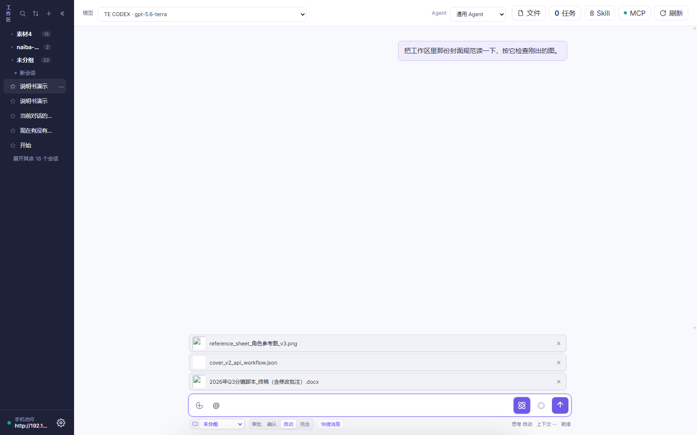

- **纯附件也能发**：输入框一个字不写，直接点发送。模型会明确收到「用户未输入文字，只发送了以下附件」+ 附件路径，不会自己脑补你的诉求。
- 上传是流式直传，有真实进度，单文件可取消，多文件最多 3 个并行，单文件上限 80MB。
- 重复文件自动去重，移除未发送的附件会自动清理文件。

## 2.4 用 `@` 引用工作区文件（2.1.0 新）

输入空格 + `@` 就弹出当前工作区的目录列表：

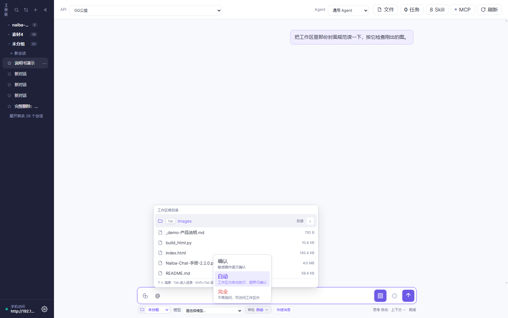

- `↑↓` 选择、**`Tab` 进入子目录**、**`Shift+Tab` 返回上级**、`Enter` 或点击即引用。
- 手机没 Tab 键：点目录行右侧的 `›` 箭头进入，列表首项「返回上一级」逐级退出。
- 引用后输入框里保留 `@相对路径` 高亮，**发送时自动替换成绝对路径**；目录保留尾部的 `/`，模型就知道要处理整个目录。
- 只有工作区里真实存在的路径才会被替换，所以 `@gmail.com` 这种普通文本不受影响。

## 2.5 让它看图、看 PDF

- **直接拖图片到输入框** → 自动作为本轮附件。
- **让它看自己之前生成的图** → 用缩略图右下角 ↩ 复用按钮发回输入框。
- **多图分批**：`vision_analyze` 单批 4 张，超出的自动分批并标注「共 N 张 / 已展示前 M 张」，模型不会误以为只有这几张。
- **PDF 三件套**（2.1.0 新）：`read_pdf` 抽文本层、`pdf_render_pages` 把页面渲成图、`pdf_zoom_region` 局部高清放大看小字和表格。扫描件（没文本层）会自动引导转页图，再让视觉模型识图。

视觉后端在「设置 → 视觉」里挑供应商，留空会走免费兜底链：


> 文本模型收到图片时只拿到路径引用，由模型按需调用 `vision_analyze`（结果以工具块呈现）；原生多模态模型直接收到原图。

## 2.6 让它执行命令

Naiba Chat **只用一个工具**：`pwsh`（PowerShell 7+）。所有系统操作都走它。

```
"在 D:\naiba-chat 下跑 pytest，失败的话把 trace 给我看"
```

## 2.7 让它发 HTTP 请求 / 联网搜

- `http_request`：GET/POST/PUT/DELETE 都行，可设 header / body / 超时。
- `web_search`：需在「设置 → 联网搜索」配置 API profile。搜索结果会作为「联网来源」折叠块附在消息末尾，**当素材引用，别当真理**。


## 2.8 长任务放后台

对耗时任务（出图、出视频、跑大命令）AI 会自动用 `run_in_background` 启动后台 Job，按 `job_output` 轮询。

> 顶栏「任务」按钮随时能看所有后台任务的历史和状态：


`run_in_background` / `job_output` / `job_status` / `job_wait` / `job_kill` 五个工具覆盖完整生命周期。

## 2.9 中途插话、暂停、取消

- **插话**：AI 跑着时，你在输入框打字回车 → AI 接住你这条引导，把当前步骤合并（用于纠偏）。
- **暂停**：消息下面的「暂停」按钮 → 停止当前轮，**已生成内容保留**。
- **取消**：右上角 ✕ → 标记当前轮为「中止」，已生成内容同样保留。
- **停止级联子任务**：取消父任务会自动 kill 所有子任务。

## 2.10 上下文用量 & Token


- **彩色环**（输入区右）：上下文用满的百分比，越满越红。
- **点开看详情**：本轮消耗（输入 / 输出 / 缓存命中率 / 请求数 / 生成速率）。
- **缓存命中率**：70% 以上是常态；突然掉到 0% 说明切了模型或改了系统提示词，DeepSeek 等支持前缀缓存的模型会贵一点。

## 2.11 本轮修改文件

每轮结束后，AI 用 `write_file` / `edit_file` 改过的文件会在消息末尾列出来：


- **`新`** = 新建，**`改`** = 编辑。
- **多媒体产物**（图片 / 视频 / 音频）走原附件卡片，**不进 chip**（避免重复）。
- **点文件名** → 右侧文件面板打开（见 2.12）。
- **中止/失败的轮次**只要写盘成功也保留记录。

## 2.12 右侧文件面板

点 chip 或顶栏「文件」按钮 → 右侧文件面板打开，多标签管理：


| 文件类型 | 行为 |
|---|---|
| **Markdown** | 直接渲染（带表格 / 代码块） |
| **文本**（.py / .json / .txt 等） | 可手动编辑 → `Ctrl/⌘+S` 或 `Ctrl/⌘+Enter` 保存回磁盘，`Esc` 取消 |
| **图片** | 直接预览，点开是大图 |
| **PDF / 二进制** | 走 PDF 三件套或给出明确提示，不再吐乱码 |

**安全边界**：面板只允许看**本会话改动过**或**位于会话工作区内**的文件，「保存写回」要求同时满足两者。路径越界一律拒绝（不能当任意文件读写入口用）。

面板左缘可以拖动调宽（280px ~ 半个窗口，会记住）。收起后顶栏出现「文件」按钮，标签都还在：


## 2.13 消息编辑重发 / 分支到新会话

- **点自己的消息** → 编辑文本 → 回车 → 从这条消息重开（**保留之前的附件和上下文**）。
- **消息右下角「分支」按钮** → 从该点分叉到新会话，旧会话保留。
- **分支会继承同一个 API 和模型名**（2.1.1），分出去的新会话不用重新选模型。

---

# 第 3 章　特色功能（重点章）

> **读完这章你能**：把 Naiba Chat 调成你顺手的样子，知道哪些功能可以替你省 1 小时/天。

每节固定结构：**痛点 → 30 秒试 → 能玩到什么程度 → 注意**。

## 3.1 每个会话单独选模型（2.1.1 新：API 与模型分离）

**痛点**：以前顶栏「模型」下拉里塞的是「API 名称 · 模型名」的拼串——切一下既换供应商又换模型，同一个会话里想只换模型（比如从便宜的换到强的）就得去设置里改；而且换完模型，图片能力还是按上一个模型记的，容易误判。

**30 秒试**

1. 看**顶栏**：现在叫「**API**」，只负责选连接配置（哪个供应商、哪个地址、哪个 Key），选项直接显示 API 名称。
2. 看**输入框下方最左边**：新增「**模型**」下拉，打开会话时会自动拉取当前 API 的模型目录，选一个就**存到这个会话**。
3. 下拉就是**当前 API 的模型目录**里有的全部模型，选中即存到这个会话（2.2.0 起不再有手写框，避免填了目录里没有的名字）。


**能玩到什么程度**

- **按会话记忆**：新建会话、继续会话都按**这个会话自己选的模型**发送。A 会话用 DeepSeek 写稿、B 会话用本地模型跑批，互不干扰。
- **分支继承**：从某条消息「分支」出来的新会话，会继承同一个 API 和模型名。
- **切 API 会清空模型名**：顶栏换 API 后，模型名一并清空让你重新选（不同供应商的模型名不一样，留着没意义）。
- **自动重新探测图像能力**：换 API 或换模型名后，`chat_supports_images` 重置为「待探测」，发送时按新模型的**真实能力**判断——换到纯文本模型不会再误发图片，换到多模态模型也不会再被当成纯文本。
- **目录里没有但以前选过**：旧会话保存的模型名如果不在当前目录里，会置顶显示成「**已保存：xxx**」并默认选中——不会被目录里第一个悄悄顶掉，发出去的模型和你保存的一致。
- 模型目录拉取失败时，回退用 API 配置里填的默认模型，不会卡住。
- 2.2.0 起 API 供应商卡片也瘦身了：只保留两行（名称 + 格式标签），模型名不再上卡片。

**注意**

> - **顶栏 = 选「去哪儿」（连接），输入区 = 选「派谁干」（模型）**，这两个现在是两个独立开关。
> - 升级到 2.1.1 会自动完成数据库 v17 迁移（给 `conversations` 表加 `model_name` 列），幂等、不会重复执行。
> - 切了会话但模型被顶掉多半是切太快：2.2.0 已修掉「目录返回时会话已切换」导致旧会话模型串到新会话的问题。
> - 老会话首次打开时模型名为空，会用它所属 API 的默认模型，确认一下再发比较稳。

## 3.2 长会话模式：聊一整天也不怕（2.1.0 头牌）

**痛点**：长对话越聊越长，token 越来越贵；而且前面跑题的几十轮一直在占用上下文，真正有用的进展被淹没了。开新会话吧，前面聊的又全丢了。

### 30 秒试：手动划一条「新会话」分割线

在任意一条 AI 回复的末尾点「**新会话**」（在「复制」右边），就会在那条回复下面画出一条分割线：

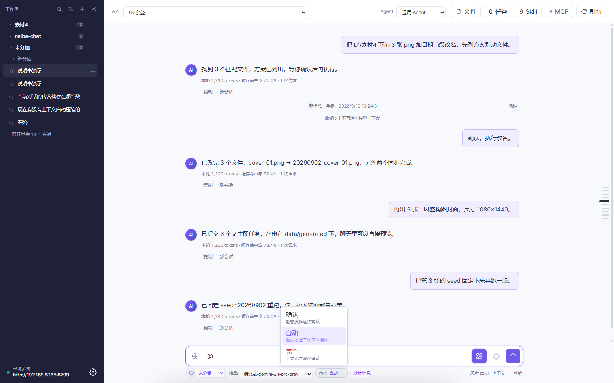

**这条线以上**的消息不再进入模型上下文，**这条线以下**的消息仍在上下文里——所以你**只裁掉前面跑题的部分、保留最近的进展**就行。聊天记录**一条不删**，随时点「撤销」把线撤掉。

### 能玩到什么程度

- **多条分割线并存**：靠时间和位置区分，最新那条决定当前上下文起点。
- **模型也能自己重置**：在 Agent 工具集里勾上 `reset_context` 后，模型可以先把交接文档写进工作区、再调用它——**文档不存在或为空会被拒绝**，每轮最多成功一次。成功后本轮立即收尾，在该条回复下画出「模型重置」分割线。
- **种子消息自动填进输入框**：模型重置后，输入框会自动填好「交接文档路径 + 请先读取再继续 + 仍在运行的后台任务清单」，**你确认后点发送**就开始新一段。模板可以在「设置 → 运行设置 → 新会话种子消息」里改（占位符 `{handoff_path}` / `{task_count}` / `{task_list}`）。
- **交接文档快捷键**：快捷消息面板里内置了「写交接报告并 reset_context」预设，点一下插进输入框就行（见 3.3）。
- **翻历史不靠翻页**：Agent 工具集里新增「长会话」一组——
  - `find_conversations`：按标题列出最近会话（id / 标题 / 时间 / 条数 / 末条预览）
  - `recall_history`：按关键词检索（不给会话 id 就全库搜、每个会话最多 3 条片段；给了 id 就只搜那个会话）
  - `read_conversation`：按序号区间读历史会话原文，用来复核片段
  - `reset_context`：重置上下文
  
  直接问 AI「上个月我们聊过的那版分镜脚本在哪」即可。检索结果会明示「检索了全部 N 个会话 / M 条消息」，**当前会话的命中会标注「在上下文中」或「已划出上下文」**——被分割线划出去的老消息不会被当成你还记得的内容。
- **「长会话模式」预设**：Agent 工具集预设里直接选，等于标准模式 + 这四件套。
- **长会话懒加载**：打开会话只渲染最近 10 轮，向上滚动自动往前补（每次 10 轮，视口不跳动），几万条历史也不卡。
- **对话刻度轨**：聊天区右侧一列横条，一轮一条，滚动时视口所在轮次会加粗凸起，悬停看概要（第 N 轮 + 用户消息一行 + 回复两行），点一下跳过去。长会话只显示附近 30 条，窄屏自动隐藏。

**注意**

> - 分割线**只影响发给模型的内容**，不影响你看到的聊天记录。
> - 划了线之后如果又想让模型参考上面的内容，点「撤销」即可，或者用 `recall_history` 把片段捞回来。
> - 模型自己调 `reset_context` 前**必须先写出交接文档**，否则会被拒绝——这是故意的，防止上下文凭空消失。

## 3.3 快捷消息：把常用提示词存成一键插入

**痛点**：有些话你一天要说十遍（「按老规矩整理一下」「写交接报告然后重置」），每次手打很烦。

**30 秒试**：输入框下方点「**快捷消息**」→ 点列表里任意一条 → 正文直接进输入框（还能改）→ 发送。

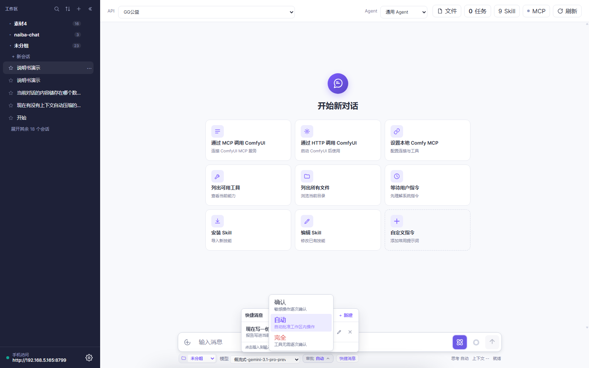

**能玩到什么程度**

- **每条只有正文、不用起标题**：列表拿正文首行当标题，其余折叠成预览。
- **自动排序**：按「使用次数 × 2 + 新鲜度加分」排，常用的稳定靠前，新加的 7/30/90 天内有曝光窗口不会永远沉底。
- 行内 `✎` 编辑、`✕` 删除、`＋ 新建` 添加（弹窗里只填正文）。
- **内置交接报告预设**（带「默认」标签）：点一下就要求模型把交接报告写进工作区，再用 `read_file` 复核后调 `reset_context`。它跟你自建的条目**同权**——可以编辑、可以删除，软件更新不会覆盖也不会复活。

**注意**：这是**独立列表**，跟开始页的自定义指令卡片互不影响，各自增删改。

## 3.4 一个不够就接一堆模型

**痛点**：单一模型又慢又贵还偏科。能不能 A 写代码 / B 写文案 / C 出图？

**30 秒试**：设置 → API 供应商 → 点「添加 API」→ 选请求格式 → 填地址 / Key / 模型名 → 点「检查」秒测连通。


**能玩到什么程度**

- **在线**：OpenAI 兼容（OpenAI / DeepSeek / Grok 等）、Anthropic、Gemini。
- **本地**：LM Studio / Ollama / llama.cpp / Unsloth，本地模型卸载在「设置 → API 供应商」里操作。
- 每个供应商独立设置温度、上下文长度、最大输出。
- **2.1.0 卡片化**：供应商和 Agent 都改成卡片网格，点卡片才弹设置表单，右上角 × 删除。
- **5xx 自动重试**：供应商返回 500/502 这类瞬时故障时自动退避重试（1.5s / 3s，最多 3 次），状态栏会提示重试进度，不再直接终止整轮。

**注意**

> - **怎么切模型**：先顶栏「API」选连接，再在输入框下方「模型」下拉选具体模型（见 3.1 节）。
> - 切换模型不影响会话历史，但会**重新探测图像能力**——换到纯文本模型后图片就不会再被发出去。
> - **切 Agent 会改首条消息固化下来的工具集**（首轮注入，之后不可改）。

## 3.5 Skill：给 AI 装"行业操作手册"

**痛点**：通用 AI 不懂你的行业术语、不熟你常用的工作流。

**30 秒试**：输入 `/` 弹窗 → 选一个 Skill（比如 `cangjie` 拆书）→ 直接对话「把这段小说拆成 12 集」。


**能玩到什么程度**

- `↑↓` 选、`Enter` 确认。
- **首轮注入** system / **后续轮追加到末尾**，保持 DeepSeek 前缀缓存稳定。
- 安装 Skill 支持 .zip / .md / 整个文件夹：

  

- 隐藏 / 恢复在「设置 → Skills 管理」：

  

**重要概念**

> **Skill 只是说明书，不是开关。** 缺 Skill 时，已授权的通用 Tool / MCP 仍可用；Skill 只指导调用方式，**不注册服务、不扩展权限**。
>
> **Skill 脚本规范**：脚本统一放 Skill 目录的 `scripts/` 子目录，读写文件要显式写 `encoding='utf-8'`。
>
> **安装目录归属（2.2.0 修了一个狠的数据事故）**：以前导入单个 `.md` 或顶层散放 `SKILL.md` 的 zip，定义文件会直接落在托管 Skills 目录的根上，**删这一个 Skill 会把整个目录搬走、所有 Skill 一起消失**。现在凡是直接落在导入根的上传都会先建独立子目录，删除前也会校验归属（越界一律拒绝）；升级时会自动把历史裸文件迁入同名子目录，引用不会断。

## 3.6 MCP：给 AI 插外设

**痛点**：AI 不能直接调 ComfyUI、数据库、第三方 API。

**30 秒试**：装好 MCP 服务器（比如 `npx -y @comfyorg/comfy-mcp`）→ 设置 → 连接状态里看到它就绪 → 直接对话「用 comfy 出 6 张封面」。


**能玩到什么程度**

- 启动时自动连接已启用的服务，没连上的做周期重试。
- 顶栏 MCP 圆点看状态：**绿=已连接、红=未连接/出错、黄=连接中、灰=未配置**，悬停看详情。
- 手机/局域网访问地址 + 访问口令也在这一页。

**注意（最常见踩坑）**

> **新加的 MCP 必须重开会话才生效。** 改完 MCP 配置 → 关掉当前会话 → 重新开 → MCP 工具才进可用集。

## 3.7 ComfyUI 自动流水线

**痛点**：跑 ComfyUI 工作流要切窗口、改参数、收图、改名、传图……繁琐。

**30 秒试**（前提：装好 ComfyUI + comfy-mcp）：

```
"用当前目录下的 cover_v2.json 出 12 张 1080x1440 封面，seed 1-12"
```

**能玩到什么程度**

- **批改本地工作流再引用路径**，别把大 JSON 贴进对话：用 `read_file` / `comfyui_prepare_workflow` 读，用 `edit_file` 局部改，再用 `comfyui_batch` 的 `workflow_paths` 提交文件路径。
- 产物自动落到 `data/generated`，聊天里直接预览、点开大图、↩ 复用。
- 后台任务完成后产物**自动挂回发起它的那条消息**，不用再追问模型。
- 视频/音频可以在气泡里直接播放（支持拖动进度条）。

**注意**

- **UI JSON ≠ API JSON**：UI 拖拽的连线图直接保存不能喂 API，导出时要选「API 格式」。
- ComfyUI 自身**不传图**给模型，AI 看的是产物缩略图（必要时调视觉模型）。

## 3.8 RunningHub 云端生成

**痛点**：本地没显卡，ComfyUI 跑不动。

**30 秒试**：装 `runninghub` Skill → 对话「用 runninghub 的文生图出 6 张古风封面」。

**能玩到什么程度**

- 不用显卡，420+ 端点：文生图、图生视频、TTS、音乐、3D、图片放大、跑任意 AI 应用。
- 产物在聊天里直接以缩略图网格预览，每张右下角 ↩ 一键发回输入框复用：

  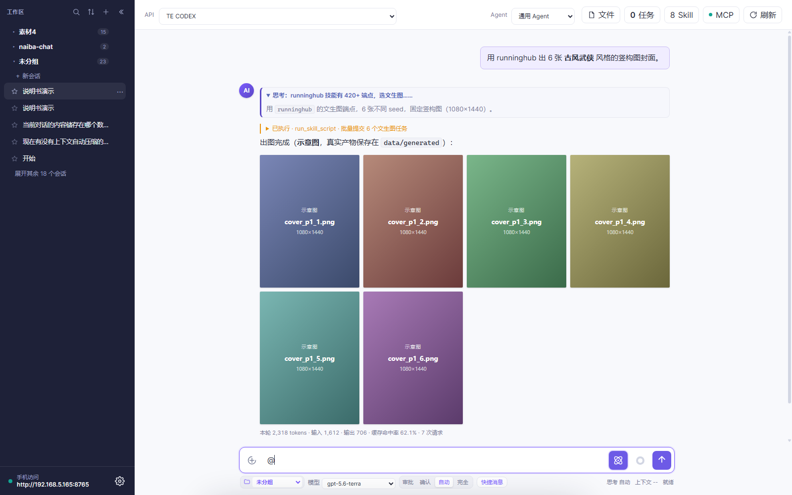

- 切换站点（国内 / 海外）在「设置 → Skills 管理」里。

**注意**：需要你自己的 RunningHub 账号和额度。

## 3.9 并行与分身

- **后台 Job**：`run_in_background` 跑长任务，不阻塞主对话。
- **子 Agent**：`subagent` 工具起一个独立 Agent 干另一件事，结束后回报。

适用：一边跑图、一边写文档；一边跑分析、一边查资料。

## 3.10 手机/局域网远程访问（2.2.0：功能对等）

**痛点**：在沙发上不想开电脑，但想让家里的 Naiba Chat 跑点啥——**而且不想因为用手机就少一堆功能**。

**30 秒试**：设置 → 连接状态 → 复制带口令和 IP 的链接 → 同一 WiFi 的手机浏览器打开。


设置页在手机上同样完整可用：

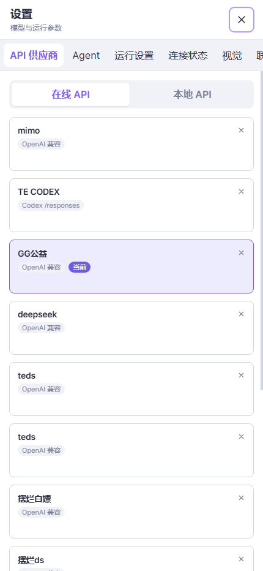

**能玩到什么程度（2.2.0「功能对等」）**

> 原则只有一句：**不删能力，只换形态**。电脑上有的，手机上都有；放不下的控件换成等价的样子。

| 桌面 | 手机上换成 |
|---|---|
| 右侧文件面板 | **全屏抽屉**（占满屏幕打开，看完关掉；和桌面共用同一套开合逻辑） |
| 消息末尾「本轮修改的文件」 | **恢复可点**，点一下直接打开文件抽屉 |
| 聊天区右侧「对话刻度轨」 | 顶栏 **「轮次」下拉**：列出「第 N 轮 · 用户消息摘要」，选中即跳过去，滚动时自动显示当前轮次（不足 2 轮自动隐藏） |
| 鼠标悬停/点击 | **触摸目标统一 ≥44px**（顶栏按钮、侧栏开关、输入区图标与发送、文件面板关闭） |

手机上点文件名，文件面板就以全屏抽屉打开：

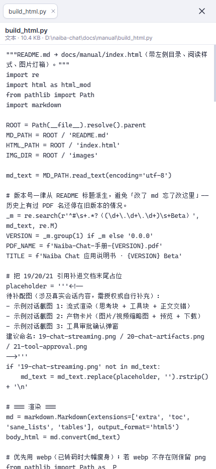

- 跨过 760px 边界（比如旋转屏幕、接外接屏）**不会顺手把文件面板关掉**。
- 窄屏也不隐藏任何文字标签，宁可整行换行，不会出现「一个问号图标猜它是啥」。
- 手机判定只有一个来源（CSS 760px 断点），不会出现「同一台设备有时像手机有时像电脑」。

**注意**：外网访问需要内网穿透；本机访问免口令，**局域网访问必须口令**。

## 3.11 权限与安全

- 对话、设置、附件、任务状态**全部存本地**，不出你的机器。
- 文件预览只允许工作区和受管理数据目录（`data/uploads`、`data/generated`）。
- **API Key 不出机器**——所有在线模型调用都从你的电脑直接发到供应商，不经中转。
- 高风险写入、删除、外部发布和凭据操作仍受权限策略保护。
- **缓存管理**：图片/PDF/视频/音频统一统计，设置页打开即刷新；超限自动清理（默认 256MB，可调，填 0 关闭）**只删未被消息引用的最旧文件**——历史消息引用的附件永不自动删除。

## 3.12 稳如老狗

- **断线重连**不重复回放：网络抖一下，不会把同一段响应重发两次。
- **失败不丢已生成内容**：模型报错，已经写出的思考/部分回复/工具活动完整保留。
- **出错自动重试**（2.1.0 起，2.2.0 扩大范围）：HTTP 5xx（含 500）与 429/502/503/504 同等对待，按 1.5s / 3s 退避重试、最多 3 次；失败请求体会落盘到 `naiba-model-error-payload.json` 取证（超长字段截断、**不含 API Key**）。
- **Codex Responses 聚合回填**（2.2.0 新）：只收到「事件汇总」没有逐字流也能正确拿到正文、思考和工具调用，不会被误判成空答复；这种格式下真出现空流会按瞬时故障重发。
- **停止级联子任务**：父任务停 → 子任务全部 kill。
- **更新带 SHA-256 校验**：下载完先校哈希再替换，损坏直接拒绝。
- **可版本回退**：更新面板支持「选历史版本 → 一键回退」。


## 3.13 侧栏、收藏与折叠


- **折叠**：桌面端点侧栏顶部 ◀ 收起（列宽恒定 880px，只是重新居中），聊天区左上 ▶ 展开，**状态会记住**。移动端左上角 ☰ 滑出抽屉。
- **收藏**：会话条目的**五角星**点一下即收藏；侧栏底部有跨工作区的「已收藏」分组。收藏**同时保留在原工作区**，两处都显示，而且**不会把会话顶到列表最前**。
- **⋯ 菜单**：重命名和删除收在这里；新建工作区也是对话框（选目录 → 填名称）。
- 条目整条可点，点击时列表不会强制滚到最上（已可见就保持位置）。

---

# 第 4 章　场景实战

> **读完这章你能**：把第 3 章的能力翻译成「我今天就用的场景」。

## 4.1 短剧/漫画批量出图

两条路：

- **本地 ComfyUI**（你有显卡）→ 3.7 节
- **云端 RunningHub**（没显卡）→ 3.8 节

**通用流程**

1. 工作区建好，参考图、风格参考放进去。
2. 提示词模板放 Skill 里（参考 `h3-prompt-writing`）。
3. AI 改本地工作流（标记哪些是占位参数）→ 批改 → 提交。
4. 产物自动进 `data/generated`，缩略图在聊天里。
5. 看效果，AI 继续改 prompt，再批跑。

**可直接复制的提示词**

> 「用当前工作区的 cover_v2.json 出 12 张 1080x1440 古风竖构图封面，seed 1-12，人物参考用 `reference_sheet.png`。出完用「本轮修改」列表给我看哪些参数改过。」

## 4.2 读懂并改造一个代码项目

```
"读 D:\my-project 下 main.py 和 requirements.txt，
告诉我这个项目在做什么、依赖什么、入口在哪。
然后把 main.py 里的硬编码路径改成支持环境变量。"
```

AI 会先 `read_file` → `search_files` 查引用 → `edit_file` 改 → 文件面板里你能直接看并改回。

## 4.3 批量整理资料 / 读 PDF

```
"把 D:\桌面\inbox 下所有 pdf 按年月重命名（YYYYMM_原名.pdf），
建个 README.md 列出改名清单。"
```

适合：下载文件夹归类、扫描件整理、合同/发票归档。扫描件（没文本层）AI 会自动转页图再用视觉模型认字。

## 4.4 一句话跑一条流水线

```
"读 E:\reports 下的 50 份 csv，统计每个用户的总消费，
按消费降序输出到 E:\reports\summary.csv，前 10 名加颜色标红。"
```

AI 自己拆步骤：列文件 → 读 → 聚合 → 写。

## 4.5 用 Skill 把 AI 调教成领域专家

- **cangjie**：拆小说 → 短剧分集
- **h3-prompt-writing / h3-text-to-promptv2**：把剧情写成 MiniMax H3 视频提示词
- **comfyui-shortdrama**：ComfyUI 短剧工作流专精
- **shortdramav2-rh**：RunningHub 上的短剧工作流

用 `/` 引用 Skill 后，AI 输出的就是该领域的标准格式，不用每次都交代。

---

# 第 5 章　设置全解

> **每个 tab 一节，按页面顺序排。**

## 5.1 API 供应商


- **卡片网格**：一行最多三张，末尾固定「添加 API」卡片，卡片右上角 × 删除；点卡片才弹设置表单。
- **请求格式**：OpenAI 兼容 / Anthropic / Gemini / Ollama / LM Studio / llama.cpp / Unsloth 等。
- **「检查」按钮**：测连通 + 测图片能力 + 测工具调用。
- **温度 / 上下文 / 最大输出**：每个供应商独立。
- **API Key 留空 = 保留原值**（不用每次重填）。

> **2.1.1 起「API」和「模型」分开了**：这一页配的是**连接**（去哪儿）。具体用哪个模型，在**输入框下方左边的「模型」下拉**里选（列表来自该 API 的模型目录），按会话记忆。详见 3.1 节。
>
> **2.2.0 卡片更紧凑**：每张卡片压成两行——名称 + 格式标签（当前使用的有角标），模型名不再上卡片，卡片高度从 116px 降到 88px。

## 5.2 Agent


- **卡片网格**：末尾固定「新增 Agent」卡片。卡片上显示固定 Skill 数和**它当前用的工具集名称**（「工具集：标准模式」/「未限制（全部工具）」/「自定义 · N 个工具」）。
- **不再标「默认」角标**——默认项由顶栏 Agent 选择器体现。
- **点卡片进编辑表单**：

  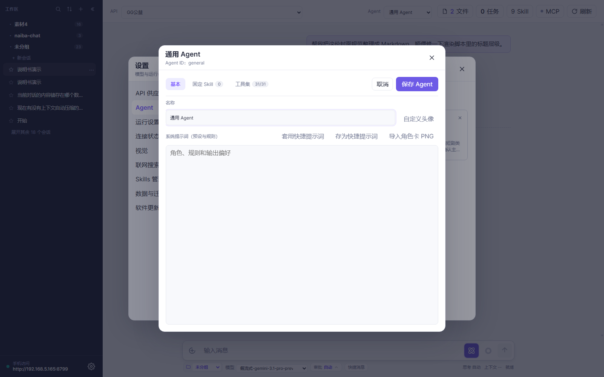

  - **ID 自动生成**：新建不用填 ID，保存时后台分配；已有 ID 显示在副标题。
  - **自定义头像**：上传图片自动中心裁切为 256px WebP；用了这个 Agent 的会话，助手气泡的「AI」圆标会换成这张头像。
  - **系统提示词（预设与规则）**：标题行右侧就是工具栏——套用快捷提示词 / 存为快捷提示词 / 导入角色卡 PNG / 自定义头像。角色卡是**追加**语义，不覆盖你手写的内容。
  - **工具集两态**：默认显示 4 张只读预设卡（只读 / 标准 / ComfyUI 联动 / 全能）+ 「我的工具集」+ 虚线「添加自定义工具集」；点任意一张，工具列表从下方滑入，命名栏自动填上卡片名字，勾选就是该卡的工具，可继续增删再存成「我的工具集」。**内置预设只读，自定义可删。**

  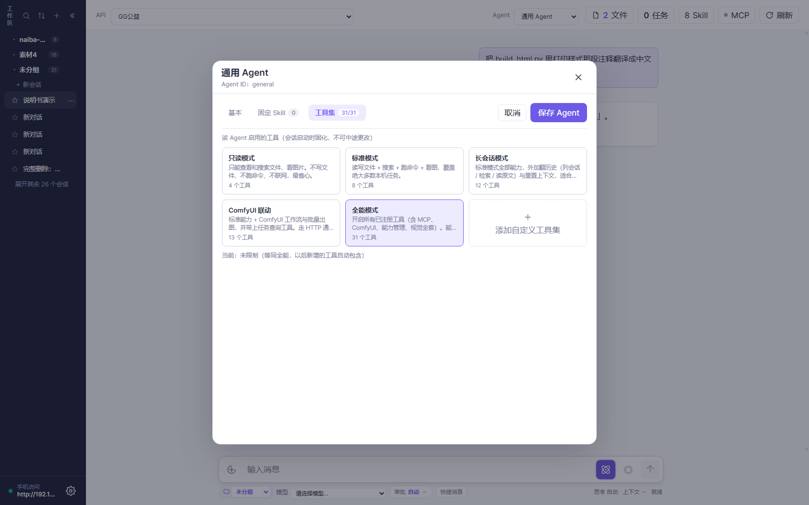

> **重要规则**：**工具集在首条消息固化，之后不可改**。要换工具集就开新会话。
>
> 2.1.0 起「我的工具集」存在后端 `config.json`（不再存 localStorage），重启不会丢。
> 想做长会话的话，工具集预设里直接选「**长会话模式**」（标准 + `find_conversations` / `recall_history` / `read_conversation` / `reset_context`）。

## 5.3 运行设置


- **命令超时**（只管工具/命令，不管模型响应）
- **上下文提醒阈值**（默认 80%，填 0 关闭）
- **新会话种子消息模板**（`{handoff_path}` / `{task_count}` / `{task_list}`）
- **原图上传**（关闭则压缩后传）、**上传最大像素 / 缩略图尺寸 / 缓存清理阈值**

## 5.4 连接状态


上半：MCP 列表（绿点已连接 / 红点出错 / 灰点未启用）。下半：手机访问地址 + 访问口令 + 局域网 URL。

## 5.5 视觉


- **视觉供应商**：留空 = 走免费兜底链
- **单次视觉请求超时（毫秒）**
- **最大图片数**：单轮占位引用的图片数上限（默认 4）

## 5.6 联网搜索


- 搜索 API profile（可配多个）
- 搜索结果当素材引用，**别当真理**

## 5.7 Skills 管理


- 已装 Skill 列表 + 启用/隐藏切换 + 恢复已隐藏。
- 装新 Skill → 点「安装 Skill」按钮或拖 .zip / .md。
- RunningHub 站点切换也在这里。


## 5.8 数据与迁移


- 数据库版本 / 数据目录 / 当前 Skills 目录 / 健康状态 / 备份位置。
- **历史数据管理**：查看数据库占用并一键压缩回收空间（实测 400MB 可压到 ~90MB，继续会话发给模型的历史消息逐字节不变）。
- 「备份」一键压缩 `data/` 到 `backups/`，**升级前必做**。

## 5.9 软件更新


- **EXE 模式**：自动检查 → 下载 → SHA-256 校验 → 提示重启。
- **源码模式**：**不支持一键更新**，需 `git pull --ff-only` 然后重启服务。
- 目标版本下拉可选历史版本 + 回退；检查完成后自动选中新版本。

## 5.10 工作区


- 工作区 = AI 可读写的根目录（**安全边界**）。
- 在输入框下方的「工作区」下拉或设置页添加，支持直接选目录 / 浏览 / 上级跳转。
- **切换分组即切换目录**：把会话移到某个工作区分组，其磁盘工作区同步指向该分组目录；「移至未分组」只改侧栏分类、保留原目录。

---

# 第 6 章　常见问题与高手技巧

## 6.1 模型连不上 / 报 500 / 代理冲突

- 「检查」按钮能告诉你**网络层 vs API Key vs 路径**是哪一层错。
- 国内访问海外供应商常需开系统代理；Naiba Chat 不内置代理，但遇到代理进程重启导致的连接拒绝会自动改用直连重试。
- 2.1.0 起 **5xx 会自动重试**（1.5s / 3s，最多 3 次）；如果三次都失败，去看进程工作目录下的 `naiba-model-error-payload.json`（不含 API Key）。
- DeepSeek 触发速率限制的话，**等 60 秒**再试。

## 6.2 ComfyUI 工作流报错

- **UI JSON ≠ API JSON**：导出时**必须**选「API 格式」。
- 报错 `Prompt outputs failed validation`：节点连线断了，重开 UI 检查。
- comfy-mcp 圆点红色：见 3.6 节。

## 6.3 MCP 工具调不到

**新加的 MCP 必须重开会话才生效。** 配完 → 关当前会话 → 重新开。

## 6.4 换了模型却不生效 / 图片发不出去

- **确认两处都选了**：顶栏「API」是连接，输入框下方「模型」才是真正干活的那一个，两个都要对。
- **换了模型仍按旧能力走**：2.1.1 起切 API 或模型名会自动把图像能力重置为「待探测」，下一次发送时按新模型的真实能力判断；如果还是不对，重开一次会话让它重新探测。
- **想让 A 会话用便宜模型、B 会话用强模型**：直接在各自的会话里选就行，模型名按会话记忆，互不干扰。

## 6.5 权限一直弹窗

审批档位从「确认」切到「自动」（工作区内免问）。完全不用问就用「完全」档（**慎用**）。

## 6.6 上下文快满了怎么办

1. 看输入框下方「上下文 x%」——70% 黄、90% 红。
2. 到 80% 会弹窗提醒，选「让模型写交接文档 + 开始新会话」。
3. 或者手动点某条回复下面的「**新会话**」划分割线。
4. 想更省：勾上 `reset_context` 工具，让模型自己判断何时重置。

## 6.7 卡住了怎么办

1. 消息下方「暂停」按钮。
2. 看「任务」面板有没有跑死的后台任务 → 杀掉。
3. 看上下文用量环是不是满了 → 划分割线或开新会话。
4. 实在不行重开会话（**会话内容会保留**）。

## 6.8 高手技巧

1. **`↑↓` 选 Skill** / **`@` 引文件用 `Tab` 进目录** / **`Enter` 发送** / **`Shift+Enter` 换行**。
2. **运行中 `Enter` 插话**（引导合并到当前轮）。
3. **`Ctrl+Enter` 全部引导**（取消当前轮 + 把引导作为新轮发）。
4. **纯附件就能发**：不写字直接点发送，模型会收到明确说明，不会瞎猜。
5. **消息分支**（点自己消息「分支」按钮）→ 新会话接着干。
6. **Token 环判断缓存命中**：掉到 0% 提示「可能改了系统提示词」。
7. **快捷消息**：把一天说十遍的话存进去，点一下就进输入框。
8. **数据目录备份再升级**：设置 → 数据与迁移 → 备份。
9. **历史太大就压缩**：设置 → 数据与迁移 → 历史数据管理 → 压缩。
10. **手机扫码直连**：设置 → 连接状态里复制带口令的局域网地址。
11. **按会话换模型**：A 会话用便宜模型跑批、B 会话用强模型写稿，各自在输入框下方「模型」下拉里选，互不干扰。

---

# 附录

## A 文件都存哪儿

```
D:\naibachatdata\               ← 数据根目录（冻结版固定 %LOCALAPPDATA%\NaibaChat）
├── config.json                 ← 主配置（含 Agent / 工具集 / 快捷消息）
├── conversations.db            ← 会话数据库
├── uploads\                    ← 你上传的附件（按日分目录）
├── generated\                  ← AI 生成的产物（缩略图 + 原图）
│   └── <conversation-id>\
│       ├── image_00000.webp    ← 原图
│       ├── image_00000_thumb.webp ← 缩略图
│       └── video_00000.mp4
├── avatars\                    ← Agent 自定义头像（256px WebP）
├── skill_history\              ← Skill 引用历史
├── backups\                    ← 备份（zip）
└── logs\                       ← 运行日志

D:\naiba-chat\                  ← 项目根（可改）
└── skills\                     ← 装在本项目的 Skill
D:\skills\                      ← 用户级 Skill（可选）
```

## B 速查卡

### 输入快捷键

| 按键 | 作用 |
|---|---|
| `/` | 弹 Skill 列表 |
| `/skill-name` | 引用指定 Skill |
| `@` | 弹工作区文件/目录列表（`Tab` 进目录、`Shift+Tab` 返回） |
| `↑↓ + Enter` | 在弹层里选择 |
| `Enter` | 发送消息 |
| `Shift+Enter` | 换行 |
| `Esc` | 关闭弹窗 / 取消编辑 / 关文件面板 |

### 顶栏左侧下拉

| 下拉 | 作用 |
|---|---|
| **API** | 选连接配置（哪个供应商 / 地址 / Key），切换后该会话的模型名清空重选 |
| **Agent** | 选人设 + 系统提示词 + 工具集（首条消息后工具集固化） |

### 顶栏按钮

| 按钮 | 作用 |
|---|---|
| 文件 | 重新打开文件面板（保留已打开的标签） |
| N 任务 | 看所有后台 Job |
| N Skill | 看当前会话已选的 Skill |
| MCP | 圆点看连接状态（绿/红/黄/灰） |
| 刷新 | 整页 reload（内嵌窗口用不了 F5 时点它） |

### 底部状态栏

| 控件 | 默认 | 说明 |
|---|---|---|
| **模型** | 跟随 API 默认 | 本会话用哪个模型；列表来自当前 API 的模型目录，按会话记忆（旧值显示「已保存：X」） |
| 工作区 | 未分组 | AI 能读写的目录根 = 安全边界 |
| **审批**（按钮） | 确认 | 点开是上拉框，三档：确认 / 自动 / 完全（完全慎用） |
| 快捷消息 | | 常用提示词一键插入 |
| 思考 自动 | ✓ | 当前思考强度（点输入区球形按钮切） |
| 上下文 -- | | 实时百分比，70% 黄 / 90% 红 |

## C 术语表

| 术语 | 一句话 + 比喻 |
|---|---|
| **Agent** | 人设 + 系统提示词 + 工具集。**比喻**：员工岗。 |
| **Skill** | 给 Agent 的"行业培训手册"。**比喻**：岗位操作手册。 |
| **MCP** | Agent 能调用的外部服务接口。**比喻**：员工桌上的电话。 |
| **Tool** | Naiba Chat 内置的能力（读文件、跑命令等）。**比喻**：员工的手。 |
| **工具集** | 一个 Agent 被允许使用的工具清单。**比喻**：上岗时发的工具箱。 |
| **Job** | 后台跑着的任务。**比喻**：员工出去跑外勤。 |
| **API（连接）** | 一个供应商的地址 + Key 配置。**比喻**：你要打哪条外线。 |
| **模型** | 具体干活的那个 AI 大脑，按会话选。**比喻**：这一单派哪位专家。 |
| **托管 Skills 目录** | Skill 的安装根，每个 Skill 一个子目录。**比喻**：书架上的一格放一本。 |
| **工作区** | AI 能读写的目录根，安全边界。**比喻**：员工能进的办公室。 |
| **审批档** | AI 跑工具要不要你点头的开关。**比喻**：出门要不要老板签字。 |
| **新会话分割线** | 在此线以上截断上下文、不删聊天记录。**比喻**：给笔记本换一页，旧页还在。 |
| **交接文档** | 重置前让 AI 写的工作小结。**比喻**：换班交接单。 |
| **刻度轨** | 聊天区右侧的一轮一条横条。**比喻**：书页侧边的章节标签。 |
| **本轮修改文件** | 一轮对话里 AI 写盘的所有文件。**比喻**：本轮会议纪要。 |
| **文件面板** | 右侧多标签的文件预览/编辑器。**比喻**：桌上摊开的文件。 |
| **缓存命中率** | DeepSeek 等模型前缀缓存的命中比例。**比喻**：省钱的程度。 |
| **上下文固化** | Agent 工具集在首条消息固定。**比喻**：上岗后不能改工种。 |

---

> **版本**：2.2.0 Beta · 截图 2026-09-10
> **项目仓库**：https://github.com/yc883123/naiba-chat
> **反馈**：https://github.com/yc883123/naiba-chat/issues
