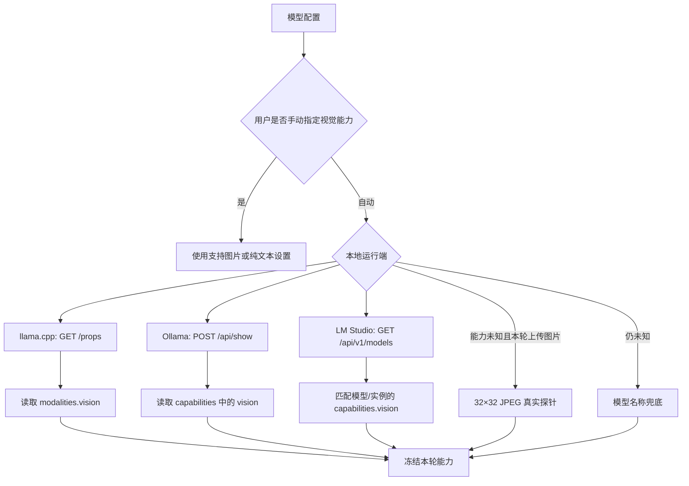

# Naiba-chat 本地模型运行端推荐（新版）

> 对比对象：llama.cpp、LM Studio、Ollama<br>
> 更新日期：2026-08-22<br>
> 适用版本：已完成新版视觉能力检测的 Naiba-chat<br>
> 数据状态：已完成第二轮复测；同一 27B 文本每端 5 次，视觉每端 5 次

---

## 1. 先看结论

| 用户需求 | 推荐运行端 | 核心理由 |
|---|---|---|
| 固定一个主力 GGUF，追求单请求效率 | **llama.cpp** | 参数透明、加载直接、同一 27B 模型综合响应最好 |
| 经常切换和管理 GGUF，不想写启动命令 | **LM Studio** | GUI、模型索引、mmproj 配对、加载卸载最直观 |
| 普通用户下载官方模型后立即使用 | **Ollama** | `ollama pull` 门槛最低，官方多模态模型自带视觉组件 |
| 共用现有散装 GGUF，不重复占磁盘 | **llama.cpp + LM Studio** | llama.cpp 直接读取，LM Studio 可使用 NTFS 硬链接 |
| Naiba-chat 面向普通用户的默认教程 | **Ollama 官方模型** | 安装和模型依赖管理最简单，较少要求用户理解 mmproj |

综合推荐不是“三选一”，而是：

```text
Naiba-chat 本地模型方案
├─ 主力高性能运行：llama.cpp
├─ GUI 管理、浏览和试用：LM Studio
└─ 官方模型生态与新手入口：Ollama
```

如果只能选择一个：

- 熟悉本地模型参数：选择 **llama.cpp**。
- 不想碰命令行：选择 **LM Studio**。
- 只想下载官方模型马上聊天：选择 **Ollama**。

---

## 2. 测试环境与公平性说明

| 项目 | 本机环境 |
|---|---|
| CPU | AMD Ryzen 7 9700X，8 核 16 线程 |
| 内存 | 47.1 GB |
| GPU | NVIDIA GeForce RTX 5070 Ti，16 GB VRAM |
| 共享模型目录 | `D:\comfyuibyte\ComfyUI_portable_TE_v260619\ComfyUI\models\LLM` |
| 同模型对比 | Qwen3.8 27B Uncensored noMTP IQ4_XS |
| 视觉投影 | Qwen3.8 27B vision f16 |
| 目标上下文 | 8192 tokens；LM Studio 实际实例最低仍报告 16384 |
| 并发 | 单并发；通过 `lms ps`、`/props`、`ollama ps` 逐端确认 |
| 文本任务 | 固定提示词，关闭思考，目标 80 个英文单词，最多 128 tokens |
| 视觉任务 | 同一张 64×64 纯红 JPEG，只回答一个英文颜色词 |
| 重复次数 | 热文本 5 次、视觉 5 次；表格取中位数 |

这些数字是当前机器上的方向性实测，不是实验室多轮平均值。运行端的上下文、并发槽、GPU offload、模型是否已经热加载，都会明显改变结果。

尤其要注意：Ollama 官方 `gemma3:4b` 与 27B GGUF 不是同体量模型，不能用它的 token/s 直接和 27B 横向比较。

---

## 3. 第二轮：同一 27B 模型效率对比

| 运行端 | 冷加载/冷请求 | 热文本中位数 | 生成速度中位数 | 首次视觉 | 视觉中位数 | 视觉结果 | 显存 |
|---|---:|---:|---:|---:|---:|---|---:|
| **llama.cpp** | 服务就绪 6.942 秒 | 2.384 秒 | 47.67 tok/s | 0.288 秒 | **0.088 秒** | 5/5 `red` | 15,870 MiB |
| **LM Studio，确认单实例** | `lms load` 9.911 秒 | 8.442 秒 | 13.93 tok/s | 1.478 秒 | 0.287 秒 | 5/5 `Red` | 14,075 MiB |
| **Ollama 手工 GGUF** | 冷请求 9.476 秒，其中加载 7.042 秒 | **2.355 秒** | **48.81 tok/s** | 不支持 | 不支持 | `/api/show` 无 `vision` | 14,936 MiB |

### 如何解读

1. **llama.cpp 仍是最完整的主力选择。** 同一 27B 的文字吞吐接近 Ollama，同时真正加载了 mmproj 并完成视觉闭环。
2. **Ollama 手工 GGUF 的文本效率略高于 llama.cpp，但差距很小。** 48.81 对 47.67 tok/s、2.355 对 2.384 秒，可视为同一档；该 manifest 没有视觉能力。
3. **LM Studio 即使确认单并发，仍明显慢于另外两端。** 本轮中位数为 13.93 tok/s，约为 llama.cpp 的 29%。
4. **视觉中位数是重复同一小图的热缓存结果。** 首次图片更有参考意义：llama.cpp 0.288 秒，LM Studio 1.478 秒。
5. LM Studio 的 115 个输出 tokens 与另外两端的 111 个略有差异，来自各协议聊天模板；token/s 已使用各运行端自己的统计字段。

### 当前效率排序

```text
同一 27B、仅看热文本：Ollama ≈ llama.cpp >> LM Studio
同一 27B、要求文字与视觉都可用：llama.cpp 第一
官方模型的最低使用门槛：Ollama 第一
```

### LM Studio 重复实例陷阱

本轮发现一个会直接影响 Naiba-chat 效率的问题：

```text
CLI 已加载：16K、单并发实例
        +
API 请求显式发送：context_length = 8192
        ↓
LM Studio 没有复用现有实例
        ↓
自动再加载一个 16K、4 并发实例
```

两个实例同时存在时，实测文本中位数恶化为 **43.173 秒、4.18 tok/s**，显存升到 15,887 MiB。卸载全部实例、重新加载一个单并发实例，并且请求不再携带冲突的 `context_length` 后，恢复到 8.442 秒、13.93 tok/s。

因此当前版本下建议：

- LM Studio 模型配置中的上下文先留空，让请求复用已经加载的实例；或确保请求上下文与实例配置完全一致。
- 测试前运行 `lms ps`，必须确认只有一个实例且 `parallel: 1`。
- Naiba-chat 后续可进一步避免因为 `context_length` 不匹配而触发第二个 LM Studio 实例。

---

## 4. Ollama 官方模型和手工导入必须分开评价

### 官方视觉模型 `gemma3:4b`

| 项目 | 实测结果 |
|---|---:|
| 下载耗时 | 44.04 秒 |
| 磁盘大小 | 约 3.11 GB |
| 第二轮冷视觉请求 | 3.414 秒 |
| 其中模型加载 | 2.995 秒 |
| 热文本中位数 | 0.668 秒，201.57 tok/s |
| 热视觉中位数 | 0.063 秒，243.66 tok/s（仅生成 2 tokens） |
| 图片回答 | 5/5 正确：`Red` |
| 显存 | 4,368 MiB |
| `/api/show` 能力 | `completion, vision` |

这个测试证明的是：

> Ollama 官方多模态模型会把视觉组件写进 manifest，普通用户无需手工配置 mmproj。

它不能证明 4B 模型比 27B 模型快多少，因为模型规模完全不同。

### 手工导入 GGUF

只有下面的 Modelfile 不足以支持图片：

```text
FROM 主模型.gguf
```

视觉模型通常还需要正确声明投影文件，例如：

```text
FROM 主模型.gguf
ADAPTER mmproj.gguf
```

旁边存在 mmproj 文件，不代表 Ollama 会自动加载。Naiba-chat 新版会读取 `/api/show.capabilities`；如果没有 `vision`，就按纯文本处理，不会把用户原图误发过去。

---

## 5. 新版 Naiba-chat 对三端的支持

新版能力判断顺序：



三端现在都能在 Naiba-chat 中可靠自动检测视觉，不再只有 llama.cpp 占优势。

| 能力 | llama.cpp | LM Studio | Ollama |
|---|---|---|---|
| Naiba-chat 原生请求协议 | OpenAI 兼容 | LM Studio 原生；工具请求走 OpenAI 兼容 | Ollama `/api/chat` |
| 运行端视觉元数据 | `/props` | `/api/v1/models` | `/api/show` |
| 自动识别 mmproj 是否真正生效 | 是 | 是，由模型/实例能力字段确认 | 是，由 manifest 能力确认 |
| 元数据未知时图片探针 | 支持 | 支持 | 支持 |
| 用户手动覆盖 | 支持 | 支持 | 支持 |
| 纯文本模型原图保护 | 支持 | 支持 | 支持 |

设置页可以选择：

- **自动检测**：推荐默认项。
- **支持图片**：运行端能力 API 不标准时手动确认。
- **纯文本**：强制禁止向该模型发送原图。

---

## 6. 三端各自在 Naiba-chat 上的优势

### 6.1 llama.cpp

优势：

- 固定模型场景下，单请求性能和可控性最好。
- 直接读取现有 GGUF 与 mmproj，不需要导入或复制。
- 上下文、并发、GPU offload、缓存和 mmproj 都能精确设置。
- `/props` 能直接告诉 Naiba-chat 当前实例是否真正加载视觉。
- 服务行为简单，出现问题时日志和启动参数容易对应。

不足：

- 启动参数多，新手学习成本最高。
- 切换模型通常要停止并重新启动服务。
- 没有完整的模型浏览和 GUI 管理。
- 激进 GPU offload 容易占满 16 GB 显存。

适合：固定使用一两个主力模型、重视速度、愿意维护启动参数的用户。

### 6.2 LM Studio

优势：

- GUI 管理、搜索、加载、卸载和查看实例状态最方便。
- 能识别标准命名的 `mmproj-*`，适合试用多个视觉 GGUF。
- `lms import --hard-link` 可以建立索引而不复制大模型。
- Naiba-chat 新版会读取 `capabilities.vision`，视觉误判问题已解决。
- 适合观察模型占用、上下文和当前加载状态。

不足：

- GUI 设置、后台服务设置、实际加载实例设置可能不一致。
- 默认并发和上下文不一定针对单请求效率优化。
- 自动加载或切换模型时，首次请求延迟可能较高。
- 排查性能时要同时检查 GUI、CLI 和 API 返回的实例状态。

适合：模型较多、经常切换量化版本、需要图形化管理的用户。

### 6.3 Ollama

优势：

- `pull / run / stop` 工作流最简单。
- 官方模型 manifest 会管理主模型、模板和视觉组件。
- 官方多模态模型对普通用户最友好。
- 文本热请求效率很好。
- Naiba-chat 新版会直接读取 `capabilities`，官方 `gemma3` 不会再被误判。

不足：

- 不会直接扫描共享目录中散放的 GGUF。
- 手工视觉 GGUF 必须正确写 Modelfile 和 `ADAPTER`。
- `ollama create` 会写入自己的 blob，可能和原始 GGUF 重复占空间。
- 运行参数精细控制不如 llama.cpp 直接。
- “官方拉取模型”和“用户手工导入模型”的可靠性差异很大。

适合：优先使用官方模型、追求低门槛、希望减少手工配对组件的用户。

---

## 7. 模型目录与磁盘效率

当前共享根目录可以这样组织：

```text
D:\comfyuibyte\ComfyUI_portable_TE_v260619\ComfyUI\models\LLM
├─ *.gguf                     # llama.cpp 直接读取
├─ local\发布者\模型仓库       # LM Studio 硬链接索引
├─ blobs                      # Ollama 内容寻址数据
└─ manifests                  # Ollama 模型清单
```

| 项目 | llama.cpp | LM Studio | Ollama |
|---|---|---|---|
| 直接读取散装 GGUF | **是** | 需建立索引 | 否 |
| 避免复制大模型 | **是** | **是，使用硬链接** | 手工导入通常不能保证 |
| 自动管理依赖组件 | 手动参数 | GUI/索引配对 | **官方 manifest 最好** |
| 适合共享现有 GGUF 仓库 | **非常适合** | **适合** | 一般 |

`OLLAMA_MODELS` 可以指向共享根目录，但 Ollama 读取的是该目录下自己的 `blobs/manifests`，不是扫描根目录的所有 `.gguf`。

---

## 8. 新版评分

5 分最高。性能评分基于当前实测；视觉可靠性评分基于新版 Naiba-chat 已实现的能力检测。

| 维度 | llama.cpp | LM Studio | Ollama |
|---|:---:|:---:|:---:|
| 当前单请求效率 | **5** | 3 | 5 |
| Naiba-chat 视觉检测可靠性 | **5** | **5** | **5** |
| 原始 GGUF 空间效率 | **5** | **5** | 2 |
| 模型切换便利性 | 2 | **5** | 4 |
| 官方模型生态 | 2 | 4 | **5** |
| 新手易用性 | 2 | 4 | **5** |
| 参数精细控制 | **5** | 4 | 3 |
| GUI 完整度 | 1 | **5** | 3 |
| 手工视觉 GGUF 可靠性 | **5** | 4 | 2 |
| 官方视觉模型开箱体验 | 2 | 4 | **5** |

---

## 9. 面向 Naiba-chat 用户的推荐方案

### 方案 A：性能优先

```text
llama.cpp
├─ 固定主力模型和 mmproj
├─ 单并发
├─ 按显存设置 GPU offload
└─ 上下文从 8K 起按需增加
```

推荐给高频使用 Naiba-chat、主要运行固定模型的用户。

### 方案 B：管理优先

```text
LM Studio
├─ 使用硬链接导入共享 GGUF
├─ 标准化 mmproj-* 文件名
├─ GUI 加载和卸载模型
└─ 性能测试时固定单并发与相同上下文
```

推荐给模型较多、需要经常比较不同量化版本的用户。

### 方案 C：普通用户优先

```text
Ollama
├─ 优先 ollama pull 官方模型
├─ 视觉任务选择官方多模态模型
├─ 避免要求用户手写 ADAPTER/mmproj
└─ 用 /api/show 确认 capabilities
```

推荐作为 Naiba-chat 面向普通用户的本地模型入门方案。

### 方案 D：三端共存

```text
共享模型根目录
├─ llama.cpp：长期加载主力模型
├─ LM Studio：浏览、导入和临时试用
└─ Ollama：保存官方模型 blobs/manifests
```

三端可以共用一个磁盘根目录，但不要同时加载多个 27B 模型。16 GB 显存通常不足以容纳多个大型实例。

---

## 10. 第二轮复测记录

本轮已经按照以下规则执行：

1. 27B 文本对比使用相同主模型和相同量化；视觉端有组件时使用同一 mmproj。Ollama 手工导入版因 manifest 缺少 mmproj，单独记为不支持视觉。
2. 目标为 8192 上下文、单并发和最大 GPU offload；LM Studio 实际实例仍固定报告 16K。
3. 相同提示词、输出 token 上限和思考设置。
4. 每端分别记录冷启动 1 次、热文本 5 次、视觉 5 次。
5. 同时记录首 token、总耗时、生成 token/s、显存峰值和图片答案正确性。
6. Ollama 分成“官方视觉模型”和“手工 GGUF + ADAPTER”两组，不混为一个结果。
7. LM Studio 使用 `lms ps` 确认单实例、单并发；其实际上下文仍为 16K，无法按目标降到 8K。

第二轮结果：

| 运行端 | 冷加载/冷请求 | 热文本中位数 | tok/s 中位数 | 首次视觉 | 视觉中位数 | 显存 | 正确率 |
|---|---:|---:|---:|---:|---:|---:|---:|
| llama.cpp 27B | 6.942 秒 | 2.384 秒 | 47.67 | 0.288 秒 | 0.088 秒 | 15,870 MiB | 5/5 |
| LM Studio 27B 单实例 | 9.911 秒 | 8.442 秒 | 13.93 | 1.478 秒 | 0.287 秒 | 14,075 MiB | 5/5 |
| Ollama 手工 27B | 9.476 秒；其中加载 7.042 秒 | 2.355 秒 | 48.81 | 不支持 | 不支持 | 14,936 MiB | 不适用 |
| Ollama 官方 gemma3:4b | 冷视觉 3.414 秒 | 0.668 秒 | 201.57 | 3.414 秒 | 0.063 秒 | 4,368 MiB | 5/5 |

测试结束后的清理状态：

- llama.cpp 测试服务已停止。
- LM Studio 模型实例已全部卸载。
- Ollama 测试模型已停止，Ollama 服务本身继续运行。
- GPU 空闲显存状态恢复到约 187 MiB 基础占用。

---

## 最终推荐

> Naiba-chat 当前的主力高性能运行端推荐 **llama.cpp**；模型管理和频繁试用推荐 **LM Studio**；普通用户的一键官方模型体验推荐 **Ollama**。

新版 Naiba-chat 已经补齐三端视觉能力检测，因此选择标准不再是“谁能被 Naiba-chat 识别为视觉模型”，而是：

```text
要性能和控制：llama.cpp
要 GUI 和模型管理：LM Studio
要官方生态和低门槛：Ollama
```
