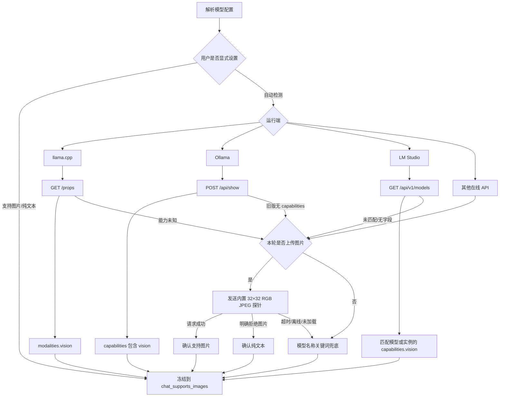

# Naiba-chat 本地模型运行端推荐

> 对比对象：llama.cpp、LM Studio、Ollama<br>
> 实测日期：2026-08-22<br>
> 结论依据：当前 Naiba-chat Build 80 代码路径与本机实测

---

## 一句话结论

| 需求 | 首选 | 原因 |
|---|---|---|
| Naiba-chat 单模型最高效率、原生识图 | **llama.cpp** | 同一 27B 模型热请求最快，Naiba-chat 能通过 `/props` 实时检测视觉 |
| 图形界面管理本地 GGUF | **LM Studio** | 导入、配对 mmproj、加载与卸载最直观，适合不想写启动参数的用户 |
| 直接下载官方模型、开箱即用 | **Ollama** | `ollama pull` 最省心，官方多模态模型会自带视觉组件 |
| 三端共用一套散装 GGUF | **llama.cpp + LM Studio** | llama.cpp 直接读取；LM Studio 可用硬链接索引，不重复占空间 |
| 三端全部使用同一个目录根 | **可以** | 但 Ollama 必须使用自己的 `blobs/manifests`，不能直接扫描散放 GGUF |

综合当前 Naiba-chat 的接入实现，默认推荐顺序为：

```text
追求性能与视觉可靠性：llama.cpp
追求 GUI 与模型管理：LM Studio
追求官方模型生态：Ollama
```

---

## 1. 本次测试环境

| 项目 | 配置 |
|---|---|
| CPU | AMD Ryzen 7 9700X，8 核 16 线程 |
| 内存 | 47.1 GB |
| GPU | NVIDIA GeForce RTX 5070 Ti，16 GB VRAM |
| 驱动 | 610.88 |
| 共享模型目录 | `D:\comfyuibyte\ComfyUI_portable_TE_v260619\ComfyUI\models\LLM` |
| 对比主模型 | Qwen3.8 27B Uncensored noMTP IQ4_XS |
| 视觉投影 | Qwen3.8 27B vision f16 |
| 测试上下文目标 | 8192 tokens |
| 输出上限 | 32–128 tokens，按是否需要等到最终答案调整 |
| 视觉测试图 | 内存生成的 64×64 纯红 JPEG |

说明：这是单机方向性测试，不是多次取平均的实验室基准。冷启动会受到磁盘缓存、CUDA 初始化、模型编译和服务默认并发设置影响。

---

## 2. 三端在 Naiba-chat 中的调用方式

```mermaid
flowchart TD
    A[Naiba-chat 本地模型请求] --> B{运行端}
    B --> C[llama.cpp]
    B --> D[LM Studio]
    B --> E[Ollama]

    C --> C1[OpenAI 兼容 /v1/chat/completions]
    C --> C2[图片使用 image_url]
    C --> C3[/props 实时报告 modalities.vision]

    D --> D1[无工具：/api/v1/chat]
    D --> D2[有工具：/v1/chat/completions]
    D --> D3[图片使用 data_url 或 image_url]

    E --> E1[原生 /api/chat]
    E --> E2[图片使用 messages.images]
    E --> E3[/api/show 可报告 capabilities]
```

Naiba-chat 会为本地请求加统一执行锁，避免视觉模型、主聊天模型和子任务同时抢占本机 GPU/RAM。因此三端在 Naiba-chat 内通常都是串行推理。

---

## 3. 同一 27B 模型效率实测

### 3.1 汇总

| 运行端 | 模型加载 | 热文本请求 | 文本生成速度 | 视觉请求 | 视觉结果 | 测试时显存 |
|---|---:|---:|---:|---:|---|---:|
| **llama.cpp** | ≤ 11 秒 | **0.46 秒** | **46.66 tok/s** | **1.89 秒** | `Red` | 约 15.9 GB |
| **LM Studio** | 15.29 秒 | 2.31 秒 | 12.47 tok/s | 7.50 秒 | `Red` | 约 13.9 GB |
| **Ollama，本地 GGUF 导入版** | 冷请求 31.27 秒，其中加载 15.16 秒 | 0.71 秒 | **49.98 tok/s** | 拒绝图片 | 缺少 mmproj | 未单独记录 |

### 3.2 为什么 LM Studio 这次较慢

LM Studio 实际加载状态显示：

```text
模型：Qwen3.8 27B + vision projector
模型占用：16.01 GB
运行上下文：16384
并发槽位：4
显存占用：约 13.9 GB
```

虽然加载命令请求 8K 上下文，当前 LM Studio 运行实例仍显示 16K、4 并发。多个并发槽和不同的 GPU/CPU 调度会拉低单请求 token/s。因此 12.47 tok/s 是当前默认运行配置的实测值，不代表 LM Studio 调成单并发后仍然只能达到这个速度。

### 3.3 llama.cpp 的表现

llama.cpp 使用：

```text
8K 上下文
单并发
99 层 GPU offload
显式加载同一 mmproj
```

文本第二次热请求为 0.46 秒，46.66 tok/s；视觉请求正确识别红色，热请求 1.89 秒、46.29 tok/s。

优点是参数透明、单请求效率高；代价是显存接近 16 GB 上限，不适合同时再加载其他大型模型。

### 3.4 Ollama 本地 GGUF 导入版

Ollama 的 Qwen3.8 文本模型热请求很快：

```text
冷请求：31.27 秒
模型加载：15.16 秒
热请求：0.71 秒
热生成：49.98 tok/s
```

但它的 Modelfile 只有：

```text
FROM 主模型.gguf
```

没有：

```text
ADAPTER mmproj.gguf
```

因此 `/api/show` 没有返回 `vision`，图片请求明确报错：

```text
image input is not supported
you may need to provide the mmproj
```

这不是 Ollama 不支持视觉，而是本地 GGUF 导入时没有把视觉投影写进 manifest。

---

## 4. Ollama 官方视觉模型补充测试

为避免只测试手工导入 GGUF，本次额外下载了 Ollama 官方模型：

```text
gemma3:4b
```

`/api/show` 返回：

```text
capabilities = completion, vision
```

实测结果：

| 项目 | 结果 |
|---|---:|
| 官方下载耗时 | 44.04 秒 |
| 模型磁盘大小 | 约 3.11 GB |
| 首次视觉请求 | 24.31 秒 |
| 其中加载时间 | 5.10 秒 |
| 热视觉请求 | 0.10 秒 |
| 热生成速度 | 约 214 tok/s |
| 图片回答 | `Red`，正确 |

注意：Gemma 3 4B 与 Qwen3.8 27B 体量差异很大，不能拿 214 tok/s 直接证明 Ollama 比另外两端快。这个测试只用于证明：

> 从 Ollama 官方仓库下载的多模态模型，其 manifest 会自动包含视觉组件，用户不需要手写 `ADAPTER/mmproj`。

---

## 5. Naiba-chat 当前视觉检测的关键差异

这是选择运行端时最需要注意的部分。

### llama.cpp

Naiba-chat 会实时请求：

```http
GET /props
```

并读取：

```json
{
  "modalities": {
    "vision": true
  }
}
```

所以即使模型名称不含 `vl` 或 `vision`，只要 llama.cpp 正确加载 mmproj，Naiba-chat 仍能识别它支持图片并直接发送原图。

### LM Studio

LM Studio 自己能在索引中准确报告：

```json
{
  "vision": true
}
```

但当前 Naiba-chat 没有读取这个字段，也没有发送真实图片探针。它主要根据 `supports_images` 配置或模型名关键词判断。

因此可能出现：

```text
LM Studio 已正确配对 mmproj
        ↓
LM Studio 本身可以识图
        ↓
模型名未包含 vl / vision 等关键词
        ↓
Naiba-chat 仍误判为纯文本模型
```

### Ollama

Ollama 的 `/api/show` 能返回：

```json
{
  "capabilities": ["completion", "vision"]
}
```

但当前 Naiba-chat 同样没有调用它进行能力判断。

这会产生两类情况：

1. `qwen3-vl`、`llava` 等名称能命中关键词，通常会被正确识别。
2. `gemma3:4b` 虽然是官方视觉模型，但名称不含现有关键词，Naiba-chat 可能误判为纯文本。

因此，**运行端支持视觉**和**Naiba-chat 识别出视觉**目前不是同一件事。

---

## 6. 模型目录与磁盘效率

当前统一目录结构：

```text
D:\comfyuibyte\ComfyUI_portable_TE_v260619\ComfyUI\models\LLM
│
├─ *.gguf
│  ├─ 主模型
│  └─ mmproj / vision projector
│
├─ local
│  └─ <发布者>/<模型仓库>/*.gguf
│     └─ LM Studio 硬链接索引
│
├─ blobs
│  └─ Ollama 内容寻址层
│
└─ manifests
   └─ Ollama 模型名称与组件清单
```

### llama.cpp

直接读取根目录 GGUF，不创建第二份模型数据，空间效率最高。

### LM Studio

通过 `lms import --hard-link` 建立标准目录。硬链接与原始 GGUF 指向同一份 NTFS 数据，不重复占用几十 GB。

### Ollama

Ollama 不会扫描根目录散放的 GGUF。即使 `OLLAMA_MODELS` 指向同一根目录，它仍然只读取：

```text
blobs
manifests
```

手工 `ollama create` 导入 GGUF 时会重新写入 blob。实测给 ToriiGate 增加 mmproj 后，额外写入了主模型和视觉投影数据；因此 Ollama 不适合用来“零复制共用散装 GGUF”。

---

## 7. 三端优势与不足

### llama.cpp

优势：

- 本次同模型单请求综合效率最好。
- 直接读取任意 GGUF 和 mmproj，不需要导入。
- `/props` 让 Naiba-chat 能可靠识别视觉能力。
- OpenAI 兼容接口成熟，图片、工具调用和诊断信息直接。
- 上下文、并发、GPU offload、mmproj 都可精确控制。

不足：

- 启动参数较多，对新手不够友好。
- 模型切换通常需要重启服务。
- 激进 GPU offload 会吃满显存。
- 缺少完整 GUI 模型管理体验。

适合：固定使用一两个模型、重视速度、愿意管理启动参数的 Naiba-chat 用户。

### LM Studio

优势：

- 本地 GGUF 导入、浏览、加载、卸载最直观。
- 能自动识别主模型与标准命名的 `mmproj-*`。
- 官方 CLI 支持硬链接导入，适合共享大模型文件。
- 同时提供原生 `/api/v1/chat` 和 OpenAI 兼容接口。
- 对首次接触本地模型的用户更友好。

不足：

- 当前默认并发与上下文设置可能牺牲单请求速度。
- 旧版 Naiba-chat 未读取 LM Studio 的真实视觉能力字段；本次优化后已读取模型目录中的 `capabilities.vision`。
- GUI、后台服务、模型实例三层状态较多，排障比 llama.cpp 更绕。

适合：经常更换 GGUF、需要 GUI、希望少写命令的用户。

### Ollama

优势：

- `ollama pull`、`run`、`stop` 的日常操作最简单。
- 官方模型 manifest 管理完整，多模态模型可开箱识图。
- 文本热请求性能很好。
- 模型名称、版本、能力和依赖组件管理清晰。
- Naiba-chat 已支持 Ollama 原生图片与工具请求格式。

不足：

- 不能直接扫描散放 GGUF。
- 手工导入视觉 GGUF 必须在 Modelfile 中配置 mmproj/ADAPTER。
- 导入 GGUF 会写入 Ollama blob，可能与原始文件重复占用空间。
- 旧版 Naiba-chat 没有读取 `/api/show.capabilities`；本次优化后官方视觉模型可被直接确认。

适合：优先使用 Ollama 官方模型、不想管理 GGUF 与 mmproj 配对的用户。

---

## 8. 推荐评分

分数为当前 Naiba-chat 接入下的相对评价，5 分最高。

| 维度 | llama.cpp | LM Studio | Ollama |
|---|:---:|:---:|:---:|
| 单请求效率 | **5** | 3 | 5 |
| Naiba-chat 视觉检测可靠性 | **5** | **5** | **5** |
| 本地 GGUF 管理 | 3 | **5** | 2 |
| 官方模型生态 | 2 | 4 | **5** |
| 新手易用性 | 2 | 4 | **5** |
| 共享原始 GGUF 的空间效率 | **5** | **5** | 2 |
| 参数控制能力 | **5** | 4 | 3 |
| GUI 完整度 | 1 | **5** | 3 |

---

## 9. 最终推荐方案

### 方案 A：Naiba-chat 主力运行端

```text
llama.cpp
├─ 固定加载主力模型
├─ 显式指定 mmproj
├─ 8K 或按需上下文
└─ 单并发优先
```

这是当前最适合追求稳定、高效和原生识图的方案。

### 方案 B：模型管理与试用

```text
LM Studio
├─ 读取同一共享目录
├─ 使用硬链接导入
├─ GUI 试模型
└─ 需要时作为 Naiba-chat 后端
```

适合模型多、经常比较量化版本的环境。

### 方案 C：官方模型和低门槛体验

```text
Ollama
├─ 优先 ollama pull 官方模型
├─ 官方多模态模型自动带视觉组件
├─ 避免让普通用户手写 mmproj
└─ blobs/manifests 保存在共享根目录
```

如果产品面向普通用户，Ollama 官方模型路线比“手工导入 GGUF + ADAPTER”可靠得多。

---

## 10. 对 Naiba-chat 的改进建议（已实现）

三端能力检测现已统一为：



实际优先级：

1. 用户显式 `supports_images` 配置。
2. 运行端真实能力 API。
3. 真实 32×32 JPEG 图片探针。
4. 最后才使用模型名称关键词推断。

实现细节：

- 纯文本聊天不会为了检测视觉而额外发送图片；只有本轮确实上传图片且运行端能力未知时才探针。
- 运行端元数据缓存 30 秒，真实图片探针缓存 300 秒；名称推断属于“未确认”，不会阻止后续图片轮执行真实探针。
- Ollama 返回 capabilities 但其中没有 `vision` 时，直接确认该模型为纯文本，不再被模型名称误导。
- LM Studio 同时匹配模型的 `id/key/model/name/display_name` 与 `loaded_instances` 标识。
- 探针超时、网络错误和模型暂未加载只表示“未知”，不会误判为永久不支持。
- 能力值在提交会话时冻结为 `chat_supports_images`，下游路由使用同一结果。
- 设置页新增“自动检测 / 支持图片 / 纯文本”；“测试连接”会显示视觉结论和检测来源。
- 任何已判断为纯文本的模型都不会收到用户原图；视觉自动路由失败时仍会安全移除图片。

这样可解决：

- Ollama 官方 `gemma3` 视觉模型被误判；
- LM Studio 已配对 mmproj 但 Naiba-chat 不知情；
- 自定义模型名称没有 `vl/vision` 时的假阴性；
- 模型名带 `vision`、实际没加载投影时的假阳性。

---

## 11. 当前机器已经完成的配置

### Ollama

```text
运行程序：D:\ollama\ollama.exe
模型根目录：D:\comfyuibyte\ComfyUI_portable_TE_v260619\ComfyUI\models\LLM
OLLAMA_MODELS：已设置为共享模型根目录
当前模型：5 个原有模型 + 官方 gemma3:4b
```

### LM Studio

```text
模型根目录：共享 LLM 目录
本地索引：local/<模型仓库>
导入方式：NTFS 硬链接
识别结果：5 个 LLM + 1 个 embedding
5 个 LLM 均报告 vision = true
```

### llama.cpp

```text
直接读取共享目录根部 GGUF
主模型与 mmproj 均可加载
/props 正确返回 modalities.vision = true
```

---

## 12. 注意事项

- 不要同时让三个运行端加载 27B 模型；16 GB 显存不足以容纳多个实例。
- LM Studio 的 projector 建议统一使用 `mmproj-*.gguf` 命名，便于自动配对。
- Ollama 手工导入 GGUF时，旁边存在 mmproj 并不代表它会自动使用。
- Ollama 官方多模态模型和手工导入 GGUF必须分开评价。
- Naiba-chat 已完成 llama.cpp、Ollama、LM Studio 的分层视觉能力检测；若运行端升级后改变字段格式，应补充对应兼容测试。
- 本次临时 Ollama 视觉导入测试留下一个 9.03 GB 未引用 blob；系统策略阻止直接删除，当前不影响模型运行，但后续可在确认后用 Ollama 官方清理机制或管理员权限清理。

---

## 最终结论

> 当前版本 Naiba-chat 的主力后端推荐 **llama.cpp**；模型浏览和管理推荐 **LM Studio**；面向普通用户的一键官方模型体验推荐 **Ollama**。

三者不是简单的互斥关系。最佳组合是：

```text
共享 GGUF 仓库
├─ llama.cpp：主力高性能运行
├─ LM Studio：GUI 管理和模型试用
└─ Ollama：官方模型生态与低门槛运行
```

---

## 附录：Unsloth 接入说明

Unsloth（Desktop / `unsloth studio`）同样以 OpenAI 兼容接口暴露本地模型。naiba-chat 已把它作为第 4 种本地后端（`Unsloth /v1/chat/completions`）接入，与 llama.cpp 走同一套协议，零新增依赖。

### 启动 Unsloth

```powershell
# 指定端口启动 Studio（默认 8000 或 8888）
unsloth studio -p 8888

# 或直接运行模型，上下文长度由 -c 决定
unsloth run --model unsloth/Qwen3-7B-GGUF -c 131072
```

### 在 naiba-chat 中配置

- 请求格式：选择 **Unsloth /v1/chat/completions**
- API URL：`http://127.0.0.1:8000` 或 `http://127.0.0.1:8888`（与启动端口一致）
- API Key：Unsloth 左下角头像 → Settings → API 创建，形如 `sk-unsloth-…`；未启用鉴权时可留空
- 模型名称：点击“检查模型”从 `GET /v1/models` 拉取，或手动填写返回的 `id`
- 上下文窗口：Unsloth 的实际上下文由服务端启动参数（`unsloth run -c <tokens>`）决定；naiba-chat 侧的“上下文窗口 Tokens”仅作容量展示，不随请求发送、不截断消息

### 能力说明

- 对话：标准 OpenAI SSE 流式，支持原生工具调用与推理思考内容（与 llama.cpp 通道一致）
- 视觉：Unsloth 不提供 llama.cpp 的 `/props` 探测端点；naiba-chat 自动回退到“模型名称关键词 + 真实图片探针”判定，加载多模态模型后可在“测试连接”中确认视觉结论
- 卸载：Unsloth 无标准手动卸载端点，设置界面不显示卸载按钮
